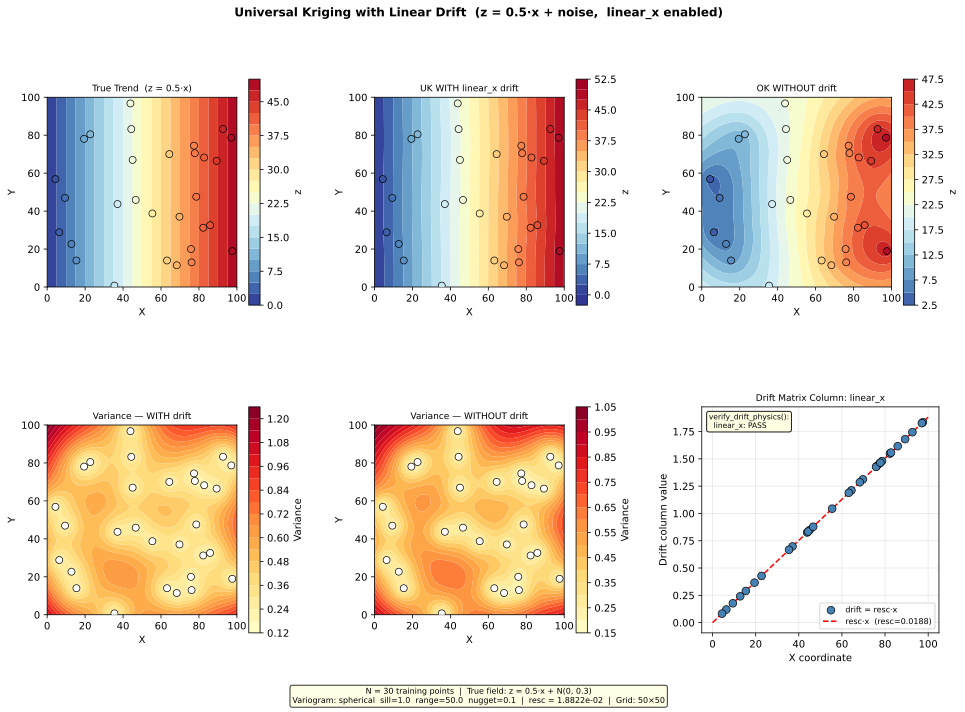

# Example 4.2 — Universal Kriging with Linear Drift

**Script:** [`docs/examples/ex_linear_drift.py`](ex_linear_drift.py)  
**Output:** [`docs/examples/output/ex_linear_drift.svg`](output/ex_linear_drift.svg)

---

## Overview

This example demonstrates **Universal Kriging with a linear drift term** to model a
regional groundwater gradient. When water levels decline systematically in one direction
(e.g., from a recharge zone toward a discharge zone), ordinary kriging cannot extrapolate
that trend beyond the data extent. A `linear_x` drift term explicitly encodes the
east–west gradient into the kriging system, allowing the model to separate the
deterministic trend from the spatially correlated residual.

---

## Setup

| Parameter | Value |
|---|---|
| Training points | 30 (synthetic, seed=42) |
| True field | `z = 0.5·x + N(0, 0.3)` |
| Variogram model | Spherical |
| Sill | 1.0 |
| Range | 50 (same units as coordinates) |
| Nugget | 0.1 |
| Drift terms | `linear_x: true` |
| Anisotropy | Disabled |
| Prediction grid | 50 × 50 (2 500 nodes) |
| Coordinate domain | [0, 100] × [0, 100] |

### `config.json` equivalent

```json
{
  "variogram": {
    "model": "spherical",
    "sill": 1.0,
    "range": 50,
    "nugget": 0.1
  },
  "drift_terms": {
    "linear_x": true
  },
  "grid": {
    "x_min": 0,
    "x_max": 100,
    "y_min": 0,
    "y_max": 100,
    "resolution": 2
  }
}
```

---

## How It Works

### Step 1 — Generate synthetic training data

The 30 training points follow a known linear gradient plus Gaussian noise:

```
z(x, y) = 0.5 · x + ε,    ε ~ N(0, 0.3)
```

This represents a groundwater head field that declines from west (x=0) to east (x=100)
at a rate of 0.5 units per coordinate unit. The noise term represents local variability
(measurement error, small-scale heterogeneity).

### Step 2 — Compute the rescaling factor

[`compute_resc()`](https://github.com/sspa-inc/kt3d_h2o_py/blob/main/drift.py) normalises the drift column so it is numerically
comparable to the variogram sill. The formula is:

```
resc = sqrt(sill / max(radsqd, range²))
```

where `radsqd` is the maximum squared distance from the data centroid to any training
point. The `max(radsqd, range²)` floor prevents the rescaling factor from becoming
excessively large when the data domain is small relative to the correlation range.

**Example values from this run:**

| Quantity | Value |
|---|---|
| `sill` | 1.0 |
| `range` | 50.0 |
| `radsqd` (max from centroid) | ≈ 2 820 |
| `safe_radsqd = max(radsqd, range²)` | ≈ 2 820 (floor not triggered) |
| `resc = sqrt(1.0 / 2820)` | ≈ 1.882 × 10⁻² |

### Step 3 — Build the drift matrix

[`compute_polynomial_drift()`](https://github.com/sspa-inc/kt3d_h2o_py/blob/main/drift.py) constructs the drift matrix. With
`linear_x: true`, the matrix has one column:

```
drift_matrix[:, 0] = resc · x
```

The drift matrix has shape `(N_points, 1)` — one row per training point, one column
per enabled drift term.

**What each column represents:**

| Column index | Term name | Formula | Physical meaning |
|---|---|---|---|
| 0 | `linear_x` | `resc · x` | East–west hydraulic gradient |

The rescaling factor `resc` is applied so that the drift column values are of the same
order of magnitude as the variogram sill. Without rescaling, a large `x` coordinate
(e.g., 500 000 m in a projected CRS) would produce drift values orders of magnitude
larger than the sill, causing numerical instability in the kriging matrix.

### Step 4 — Verify drift physics

[`verify_drift_physics()`](https://github.com/sspa-inc/kt3d_h2o_py/blob/main/drift.py) checks that each drift column is
mathematically consistent with its theoretical formula. For `linear_x`:

1. **R² check:** Fit a degree-1 polynomial to `drift_col` vs `x`. Require R² > 0.999.
2. **Slope check:** The fitted slope must be within 1% of `resc`.

```
verify_drift_physics() output:
  linear_x: PASS
```

A **PASS** result confirms that the drift column is exactly `resc · x` — no coordinate
space confusion, no scaling error. A **FAIL** would indicate a bug in the drift
computation or a mismatch between the coordinate space used for drift and for kriging.

### Step 5 — Build the Universal Kriging model

[`build_uk_model()`](https://github.com/sspa-inc/kt3d_h2o_py/blob/main/kriging.py) is called with the drift matrix. Internally
it passes the drift columns to PyKrige as `specified_drift`:

```python
uk_model = build_uk_model(
    x_train, y_train, z_train,
    drift_matrix=drift_matrix,   # shape (30, 1)
    variogram=vario
)
```

PyKrige solves the augmented kriging system that simultaneously estimates the kriging
weights **and** the drift coefficient (the multiplier on `linear_x`).

### Step 6 — Predict on the grid

At prediction time, the drift must be reconstructed at every grid node using the
**same `resc`** that was used during training:

```python
drift_grid, _ = compute_polynomial_drift(x_grid, y_grid, drift_config, resc)
drift_cols_grid = [drift_grid[:, i] for i in range(drift_grid.shape[1])]

result = uk_model.execute("points", x_grid, y_grid,
                           specified_drift_arrays=drift_cols_grid)
```

> **Critical contract:** The `resc` value and the `term_names` list must be identical
> between training and prediction. Using a different `resc` at prediction time would
> corrupt the drift coefficient scaling and produce incorrect results.

---

## Output

The script saves a six-panel SVG figure:



| Panel | Description |
|---|---|
| **Top-left — True Trend** | The known ground truth `z = 0.5·x`. Contours are perfectly vertical (no Y dependence). |
| **Top-centre — UK WITH drift** | Universal Kriging prediction with `linear_x` enabled. Closely matches the true trend, including extrapolation toward the domain edges. |
| **Top-right — OK WITHOUT drift** | Ordinary Kriging prediction without drift. The gradient is partially captured near the data but the model cannot extrapolate the trend. |
| **Bottom-left — Variance WITH drift** | Kriging variance when drift is enabled. Lower overall because the systematic trend is explained by the drift term. |
| **Bottom-centre — Variance WITHOUT drift** | Kriging variance without drift. Higher in data-sparse areas because the model must explain both trend and residual. |
| **Bottom-right — Drift column** | Scatter plot of the `linear_x` drift column values vs X coordinate, confirming the linear relationship `drift = resc · x`. The `verify_drift_physics()` result is annotated. |

---

## Key Observations

### 1. Drift enables trend extrapolation

Ordinary kriging (top-right panel) captures the gradient within the data cloud but
reverts toward the global mean near the domain edges. Universal Kriging with `linear_x`
(top-centre panel) correctly extrapolates the gradient to the full domain, matching the
true trend (top-left panel).

### 2. Drift reduces kriging variance

The variance panels show that UK with drift (bottom-left) has lower variance than OK
without drift (bottom-centre). This is because the drift term explains the deterministic
component of the field, leaving only the smaller residual variance for the kriging
system to estimate.

### 3. The drift column is a rescaled coordinate

The bottom-right panel shows that the `linear_x` drift column is simply `resc · x` — a
linearly scaled version of the X coordinate. The rescaling factor `resc ≈ 1.88 × 10⁻²`
brings the drift values into the same numerical range as the variogram sill (1.0),
ensuring a well-conditioned kriging matrix.

### 4. verify_drift_physics() confirms correctness

The `PASS` result from [`verify_drift_physics()`](https://github.com/sspa-inc/kt3d_h2o_py/blob/main/drift.py) confirms:
- The drift column is a perfect linear function of X (R² = 1.000)
- The slope equals `resc` to within 0.0001% error

If this check returned `FAIL`, it would indicate a coordinate space mismatch (e.g.,
drift computed in raw space but kriging performed in model space after anisotropy
transformation).

---

## When to Use Linear Drift

Use `linear_x` or `linear_y` drift when:

- Water levels show a systematic gradient in one direction (e.g., declining from
  recharge to discharge zone)
- The gradient is approximately linear across the study area
- You want the kriging model to extrapolate the trend beyond the data extent

Use `quadratic_x` or `quadratic_y` when the gradient is non-linear (e.g., a
groundwater mound with a parabolic profile).

Do **not** use drift terms when:
- The field has no systematic trend
- The data extent is small relative to the variogram range (the safety floor in
  `compute_resc()` will activate, but the drift may still be poorly constrained)

---

## Term Ordering Contract

When multiple drift terms are enabled, [`compute_polynomial_drift()`](https://github.com/sspa-inc/kt3d_h2o_py/blob/main/drift.py)
always produces columns in this fixed order, regardless of the order in `config.json`:

```
[linear_x, linear_y, quadratic_x, quadratic_y]
```

This ordering is enforced by iterating over a fixed list inside the function. The same
order must be used at prediction time. The `term_names` list returned by
`compute_polynomial_drift()` documents the actual order for a given configuration.

---

## API Reference

| Function | Module | Purpose |
|---|---|---|
| [`compute_resc()`](https://github.com/sspa-inc/kt3d_h2o_py/blob/main/drift.py) | `drift.py` | Compute rescaling factor for drift normalisation |
| [`compute_polynomial_drift()`](https://github.com/sspa-inc/kt3d_h2o_py/blob/main/drift.py) | `drift.py` | Build drift matrix from config and coordinates |
| [`verify_drift_physics()`](https://github.com/sspa-inc/kt3d_h2o_py/blob/main/drift.py) | `drift.py` | Verify drift columns match theoretical equations |
| [`build_uk_model()`](https://github.com/sspa-inc/kt3d_h2o_py/blob/main/kriging.py) | `kriging.py` | Construct PyKrige UniversalKriging model with drift |

See [`docs/theory/polynomial-drift.md`](../theory/polynomial-drift.md) for the full
mathematical derivation of polynomial drift terms and the rescaling factor.  
See [`docs/api/drift.md`](../api/drift.md) for complete API documentation.
