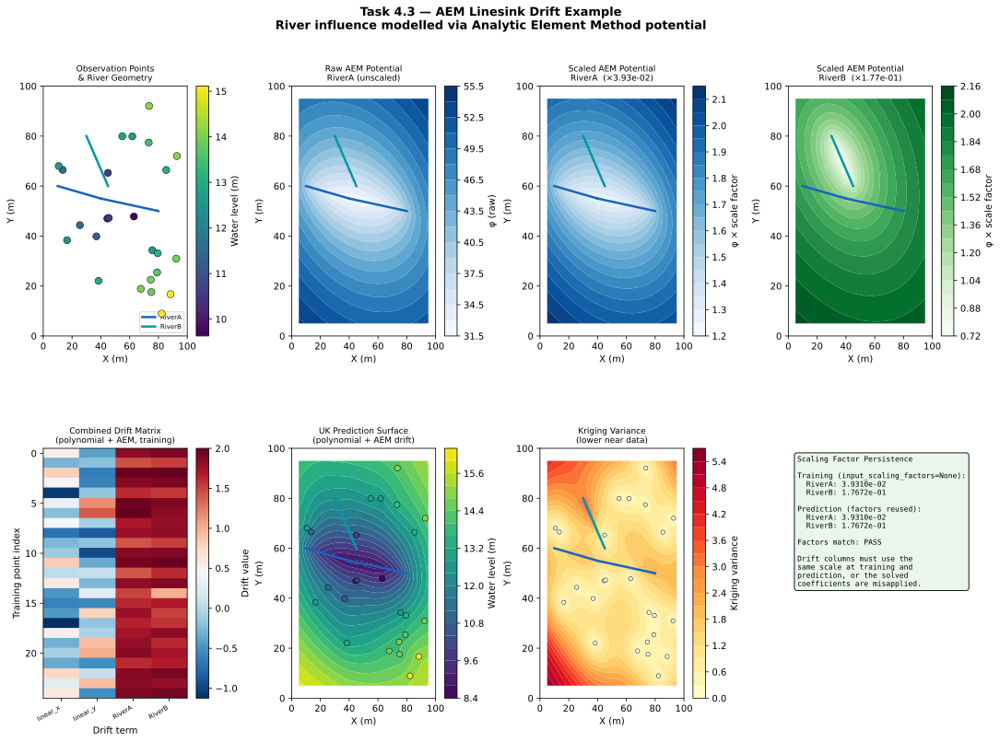

# Example 4.3 — Incorporating River Effects with AEM Linesink Drift

**Script:** [`docs/examples/ex_linesink_drift.py`](ex_linesink_drift.py)  
**Output:** [`docs/examples/output/ex_linesink_drift.svg`](output/ex_linesink_drift.svg)

---

## Overview

This example demonstrates **Universal Kriging with AEM (Analytic Element Method)
linesink drift** to model the hydraulic influence of rivers on groundwater levels.
Rivers act as boundary conditions in groundwater systems — water levels near a
gaining river are elevated relative to the regional trend, while levels near a
losing river may be depressed. The AEM linesink drift term captures this spatial
pattern as a deterministic component of the kriging model.

The example is **fully self-contained**: the synthetic river shapefile is created
programmatically inside the script, so no external data files are required.

---

## Setup

| Parameter | Value |
|---|---|
| Training points | 25 (synthetic, seed=42) |
| True field | Water levels influenced by AEM potential of RiverA + noise |
| Variogram model | Spherical |
| Sill | 2.0 |
| Range | 40 (same units as coordinates) |
| Nugget | 0.1 |
| Anisotropy | Enabled — angle=60° azimuth (CW from North, N60E direction), ratio=0.7 |
| Drift terms | `linear_x`, `linear_y` (polynomial) + `RiverA`, `RiverB` (AEM) |
| Prediction grid | 50 × 50 (2 500 nodes) |
| Coordinate domain | [0, 100] × [0, 100] |

### River geometry

| Group | Segments | Resistance | Description |
|---|---|---|---|
| `RiverA` | 2 (connected) | 1.0 | Main channel, east-west |
| `RiverB` | 1 | 0.6 | Tributary, NW–SE |

### `config.json` equivalent

```json
{
  "data_sources": {
    "observation_wells": {
      "path": "path/to/wells.shp",
      "water_level_col": "wl_m"
    },
    "linesink_river": {
      "path": "path/to/river.shp",
      "group_column": "group",
      "strength_col": "resistance",
      "rescaling_method": "adaptive"
    }
  },
  "variogram": {
    "model": "spherical",
    "sill": 2.0,
    "range": 40,
    "nugget": 0.1,
    "anisotropy": {
      "enabled": true,
      "ratio": 0.7,
      "angle_major": 60
    }
  },
  "drift_terms": {
    "linear_x": true,
    "linear_y": true,
    "linesink_river": {
      "use": true,
      "apply_anisotropy": true
    }
  },
  "grid": {
    "x_min": 0, "x_max": 100,
    "y_min": 0, "y_max": 100,
    "resolution": 2
  }
}
```

---

## How It Works

### Step 1 — Create the synthetic river shapefile

The script builds a `GeoDataFrame` with three `LineString` geometries and writes
it to a temporary shapefile using `geopandas`. This mirrors exactly what the
production pipeline reads from `data_sources.linesink_river.path`.

```python
river_segments = [
    {"geometry": LineString([(10, 60), (40, 55)]), "group": "RiverA", "resistance": 1.0},
    {"geometry": LineString([(40, 55), (80, 50)]), "group": "RiverA", "resistance": 1.0},
    {"geometry": LineString([(30, 80), (45, 60)]), "group": "RiverB", "resistance": 0.6},
]
river_gdf = gpd.GeoDataFrame(river_segments, crs="EPSG:32632")
river_gdf.to_file(river_shp_path)
```

Segments sharing the same `group` value are **summed** into a single drift column.
Here `RiverA` contributes one column (sum of its two segments) and `RiverB`
contributes a second column.

### Step 2 — Coordinate transformation

Because anisotropy is enabled, all coordinates are transformed to **model space**
before kriging:

```python
transform_params = get_transform_params(x_obs, y_obs, angle_deg=60.0, ratio=0.7)
x_model, y_model = apply_transform(x_obs, y_obs, transform_params)
```

The transformation:
1. Translates to the data centroid
2. Converts azimuth 60° to arithmetic 30° internally (`alpha = 90 - azimuth`)
3. Rotates using the arithmetic angle so the major correlation axis
   aligns with the X-axis in model space
4. Scales the Y-axis by `1/0.7 ≈ 1.43` to make the field isotropic

> **Angle convention:** `angle_major=60°` is an azimuth (clockwise from North),
> meaning the major axis of spatial correlation points in the **N60E direction**.
> This matches the KT3D SETROT convention. Internally converted to 30° arithmetic.

### Step 3 — AEM drift matrix (training)

[`compute_linesink_drift_matrix()`](../../AEM_drift.py:53) is called with
`input_scaling_factors=None` (training phase):

```python
aem_matrix_train, aem_names, trained_scaling_factors = compute_linesink_drift_matrix(
    x_model, y_model,
    river_gdf,
    group_col="group",
    transform_params=transform_params,
    sill=SILL,
    strength_col="resistance",
    rescaling_method="adaptive",
    apply_anisotropy=True,
    input_scaling_factors=None   # training: compute factors from data
)
```

Because `apply_anisotropy=True`, the linesink segment endpoints are also
transformed to model space before the AEM potential is evaluated. This ensures
the river geometry is consistent with the anisotropically-transformed observation
coordinates.

The function returns:
- `aem_matrix_train` — shape `(N_obs, N_groups)`, one column per river group
- `aem_names` — `['RiverA', 'RiverB']`
- `trained_scaling_factors` — `{'RiverA': 3.93e-02, 'RiverB': 1.77e-01}`

### Step 4 — Polynomial drift

Linear polynomial terms are computed in model space:

```python
resc = compute_resc(SILL, x_model, y_model, RANGE)
poly_matrix_train, poly_names = compute_polynomial_drift(
    x_model, y_model,
    {"drift_terms": {"linear_x": True, "linear_y": True}},
    resc
)
```

`resc` normalises the polynomial columns to be numerically comparable to the
variogram sill, preventing ill-conditioning of the kriging matrix.

### Step 5 — Combined drift matrix

The polynomial and AEM columns are concatenated horizontally:

```python
combined_matrix_train = np.hstack([poly_matrix_train, aem_matrix_train])
# shape: (25, 4)  →  columns: [linear_x, linear_y, RiverA, RiverB]
```

The **column order** is the `term_names` contract: `[linear_x, linear_y, RiverA, RiverB]`.
This order must be reproduced identically at prediction time.

### Step 6 — Build UK model

```python
uk_model = build_uk_model(x_model, y_model, z_obs, combined_matrix_train, vario)
```

[`build_uk_model()`](../../kriging.py:46) passes the drift columns to PyKrige as
`drift_terms=["specified"]` with `specified_drift` containing each column as a
1-D array. PyKrige solves the Universal Kriging system and stores the drift
coefficients internally.

### Step 7 — Grid prediction (reusing scaling factors)

At prediction time, the **same** `trained_scaling_factors` must be passed back
to `compute_linesink_drift_matrix()`:

```python
aem_grid, _, _ = compute_linesink_drift_matrix(
    gx_model, gy_model,
    river_gdf,
    group_col="group",
    transform_params=transform_params,
    sill=SILL,
    strength_col="resistance",
    rescaling_method="adaptive",
    apply_anisotropy=True,
    input_scaling_factors=trained_scaling_factors   # <- critical
)
```

If `input_scaling_factors` is omitted, the function recomputes scaling from the
grid points' potential values, which will differ from the training-phase scaling.
The drift coefficients solved during training would then be applied to
differently-scaled columns, producing incorrect predictions.

---

## The AEM Potential

The potential at a point `(x, y)` due to a single linesink segment from
`(x1, y1)` to `(x2, y2)` with strength `σ` and length `L` is:

```
φ = (σ · L / 4π) · Re[(ZZ+1)ln(ZZ+1) − (ZZ−1)ln(ZZ−1) + 2ln(L_vec/2) − 2]
```

where `ZZ = (z − mid) / half_L_vec` maps the physical plane to the normalised
segment coordinate `[-1, 1]`, and `z = x + iy` is the complex coordinate.

The potential is highest near the segment and decays with distance. Multiple
segments in the same group are **summed** before scaling.

---

## Scaling Factor Persistence

| Phase | `input_scaling_factors` | Behaviour |
|---|---|---|
| Training | `None` | Factors computed as `sill / max(|φ|)` for each group |
| Prediction | `trained_scaling_factors` | Stored factors reused exactly |
| Prediction (wrong) | `None` | New factors computed from grid — **incorrect** |

The adaptive scaling formula is:

```
rescr = sill / max(|φ|)
```

This normalises each group's potential so its maximum value equals the variogram
sill, making the AEM drift columns numerically comparable to the polynomial drift
columns and to the variogram covariance values.

---

## Output Figure

The SVG figure contains eight panels:

| Panel | Content |
|---|---|
| Top-left | Observation points coloured by water level, with river geometry |
| Top-centre-left | Raw (unscaled) AEM potential field for RiverA |
| Top-centre-right | Scaled AEM potential field for RiverA (after `× 3.93e-02`) |
| Top-right | Scaled AEM potential field for RiverB (after `× 1.77e-01`) |
| Bottom-left | Combined drift matrix heatmap (all 4 columns, all 25 training points) |
| Bottom-centre-left | UK prediction surface with observation points and river overlay |
| Bottom-centre-right | Kriging variance (lower near data, higher in gaps) |
| Bottom-right | Scaling factor persistence explanation and verification result |



---

## Key Takeaways

1. **River geometry is self-contained** — the shapefile is created by the script;
   no external data files are needed.

2. **`apply_anisotropy=True`** means the linesink segment endpoints are
   transformed to model space before AEM potential evaluation. This keeps the
   river geometry consistent with the anisotropically-transformed observation
   coordinates.

3. **Scaling factors are a training artifact** — they must be stored after
   training and passed to every subsequent prediction call via
   `input_scaling_factors`. The script verifies this explicitly and prints
   `PASS` when the factors match.

4. **Column order is a contract** — the combined drift matrix always follows
   `[linear_x, linear_y, <AEM groups in group_col order>]`. Changing this order
   between training and prediction will corrupt the kriging solution.

5. **Adaptive vs fixed rescaling** — `rescaling_method='adaptive'` (default)
   normalises each group's potential to the variogram sill. `'fixed'` uses the
   KT3D constant `sill / 0.0001`, which can produce very large drift values in
   metric coordinate systems.

---

## See Also

- [`docs/theory/aem-linesink.md`](../theory/aem-linesink.md) — AEM theory and
  the complex potential formula
- [`docs/api/aem_drift.md`](../api/aem_drift.md) — Full API reference for
  `compute_linesink_drift_matrix()`
- [`docs/examples/ex_linear_drift.md`](ex_linear_drift.md) — Polynomial drift
  example (simpler starting point)
- [`docs/examples/ex_anisotropy.md`](ex_anisotropy.md) — Anisotropy handling
  example
