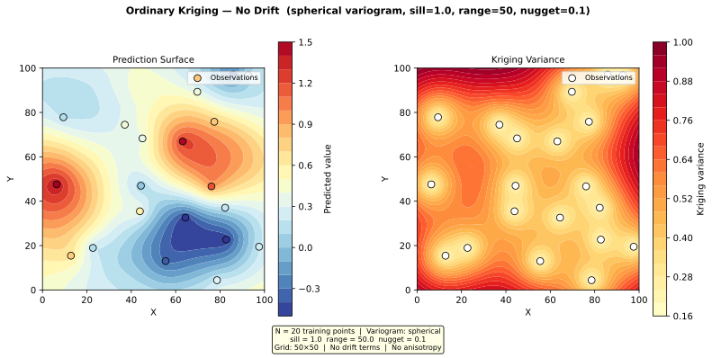

# Example 4.1 — Ordinary Kriging (No Drift)

**Script:** [`docs/examples/ex_ordinary_kriging.py`](ex_ordinary_kriging.py)  
**Output:** [`docs/examples/output/ex_ordinary_kriging.svg`](output/ex_ordinary_kriging.svg)

---

## Overview

This example demonstrates the simplest use case of the UK_SSPA v2 kriging pipeline:
**ordinary kriging with no drift terms and no anisotropy**.

Ordinary kriging assumes the mean of the field is unknown but constant. It is the
appropriate choice when there is no systematic spatial trend in the data (no regional
gradient, no river influence). The kriging system solves for both the weights and the
unknown mean simultaneously via the unbiasedness constraint.

---

## Setup

| Parameter | Value |
|---|---|
| Training points | 20 (synthetic, seed=42) |
| Variogram model | Spherical |
| Sill | 1.0 |
| Range | 50 (same units as coordinates) |
| Nugget | 0.1 |
| Drift terms | None |
| Anisotropy | Disabled |
| Prediction grid | 50 × 50 (2 500 nodes) |
| Coordinate domain | [0, 100] × [0, 100] |

### Minimal `config.json` equivalent

```json
{
  "variogram": {
    "model": "spherical",
    "sill": 1.0,
    "range": 50,
    "nugget": 0.1
  },
  "drift_terms": {},
  "grid": {
    "x_min": 0,
    "x_max": 100,
    "y_min": 0,
    "y_max": 100,
    "resolution": 2
  }
}
```

No `anisotropy` block is needed. No `data_sources.linesink_river` block is needed.

---

## How It Works

### Step 1 — Generate synthetic training data

The 20 training points are drawn from a spatially correlated random field whose
covariance structure matches the specified spherical variogram. This is done via
Cholesky decomposition of the covariance matrix:

```python
C[i,j] = spherical_cov(dist[i,j], sill=1.0, range_=50, nugget=0.1)
L = np.linalg.cholesky(C)
z = L @ np.random.standard_normal(N)
```

### Step 2 — Build the ordinary kriging model

[`build_uk_model()`](../../kriging.py:46) is called with `drift_matrix=None`. When no
drift matrix is provided (or an empty `N×0` matrix is passed), the function omits the
`drift_terms` keyword from the PyKrige constructor entirely, producing an ordinary
kriging model:

```python
uk_model = build_uk_model(
    x_train, y_train, z_train,
    drift_matrix=None,   # ordinary kriging — no drift
    variogram=vario
)
```

The log message confirms: `Building OrdinaryKriging (no specified drift terms provided).`

### Step 3 — Predict on a 50×50 grid

Grid nodes are generated with `np.meshgrid` and predictions are obtained by calling
`uk_model.execute("points", x_grid, y_grid)` directly. This returns:

- **`z_pred`** — the kriging estimate at each grid node
- **`z_var`** — the kriging variance (uncertainty) at each grid node

Kriging variance is **zero at observation locations** (exact interpolation when
nugget = 0) and increases with distance from observations, reaching the sill value
in areas far from any data.

> **Note:** With nugget = 0.1, the variance at observation locations equals the nugget
> (not zero), because the nugget represents micro-scale variability or measurement error.

---

## Output

The script saves a two-panel SVG figure:



| Panel | Description |
|---|---|
| **Left — Prediction Surface** | Filled contour map of the kriging estimate. Observation points are overlaid, coloured by their measured value. |
| **Right — Kriging Variance** | Filled contour map of the kriging variance. Low variance (yellow) near observations; high variance (red) in data-sparse areas. |

---

## Key Observations

1. **Exact interpolation tendency:** The prediction surface passes close to each
   observation value. The small nugget (0.1) allows slight smoothing at data locations.

2. **Variance pattern reflects data density:** Variance is lowest near clusters of
   observations and highest in corners and edges of the domain where data are sparse.
   The maximum variance approaches the sill (1.0) in the most data-sparse regions.

3. **No trend removal:** Because no drift terms are specified, the kriging estimate
   represents the raw spatial interpolation. If the data had a systematic gradient
   (e.g., water levels declining from north to south), ordinary kriging would still
   interpolate correctly but would not extrapolate the trend beyond the data extent.

---

## When to Use Ordinary Kriging

Use ordinary kriging (no drift) when:

- The spatial field has no systematic trend within the study area
- You have sufficient data coverage that the mean can be estimated locally
- You want the simplest, most robust interpolation

Use Universal Kriging with drift terms (Tasks 4.2–4.3) when:

- There is a known regional gradient (e.g., hydraulic head declining in one direction)
- Rivers or other features create a systematic influence on the field
- The data extent is large relative to the variogram range

---

## API Reference

| Function | Module | Purpose |
|---|---|---|
| [`build_uk_model()`](../../kriging.py:46) | `kriging.py` | Constructs PyKrige UniversalKriging model |
| [`uk_model.execute()`](../../kriging.py:128) | PyKrige | Predicts at arbitrary points |

See [`docs/api/kriging.md`](../api/kriging.md) for full API documentation.  
See [`docs/theory/variogram-models.md`](../theory/variogram-models.md) for variogram model equations.
