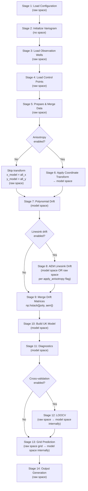

# UK_SSPA v2 — Workflow Reference

## Overview

This document describes the complete execution pipeline as implemented in [`main()`](https://github.com/sspa-inc/kt3d_h2o_py/blob/main/main.py). The pipeline is a linear sequence of stages that loads data, builds a Universal Kriging model with optional drift terms, and generates spatial predictions and outputs.

---

## Pipeline Flowchart



---

## Stage Reference Table

| Stage | Function(s) Called | Inputs | Outputs | Coordinate Space | Failure Modes |
|---|---|---|---|---|---|
| 1. Configuration loading | [`load_config()`](https://github.com/sspa-inc/kt3d_h2o_py/blob/main/data.py) | `config.json` path | `config` dict | N/A | `FileNotFoundError` if path missing; `KeyError` if required keys absent; `ValueError` for invalid numeric values |
| 2. Variogram initialization | [`variogram()`](https://github.com/sspa-inc/kt3d_h2o_py/blob/main/variogram.py) | `config` dict | `variogram` object | N/A | `ValueError` if sill ≤ 0, nugget ≥ sill, range ≤ 0, or ratio outside (0,1] |
| 3. Observation well loading | [`load_observation_wells()`](https://github.com/sspa-inc/kt3d_h2o_py/blob/main/data.py) | `config` dict | `wx`, `wy`, `wh` arrays | Raw | `FileNotFoundError` if shapefile missing; `KeyError` if `water_level_col` absent |
| 4. Control point loading | [`load_line_features()`](https://github.com/sspa-inc/kt3d_h2o_py/blob/main/data.py) | `source_conf`, `config` | `cx`, `cy`, `ch`, `cn` arrays per source | Raw | Warning logged and source skipped on failure; does not abort pipeline |
| 5. Data preparation | [`prepare_data()`](https://github.com/sspa-inc/kt3d_h2o_py/blob/main/data.py) | `wx`,`wy`,`wh`, `ctrl_points_list`, `config` | `all_x`, `all_y`, `all_h` arrays | Raw | Returns empty arrays if no data; pipeline exits with error log |
| 6. Coordinate transformation | [`get_transform_params()`](https://github.com/sspa-inc/kt3d_h2o_py/blob/main/transform.py), [`apply_transform()`](https://github.com/sspa-inc/kt3d_h2o_py/blob/main/transform.py) | `all_x`, `all_y`, `angle_major`, `ratio` | `transform_params` dict, `x_model`, `y_model` | Raw → Model | Skipped entirely when `anisotropy.enabled = false`; `x_model = all_x` in that case |
| 7. Polynomial drift | [`compute_resc()`](https://github.com/sspa-inc/kt3d_h2o_py/blob/main/drift.py), [`compute_polynomial_drift()`](https://github.com/sspa-inc/kt3d_h2o_py/blob/main/drift.py) | `x_model`, `y_model`, `config`, `resc` | `drift_matrix_poly`, `term_names_poly` | Model | Skipped if no drift terms enabled; returns zero-column matrix |
| 8. AEM linesink drift | [`compute_linesink_drift_matrix()`](https://github.com/sspa-inc/kt3d_h2o_py/blob/main/AEM_drift.py) | `calc_x`, `calc_y`, `linesinks_gdf`, `group_column`, `transform_params`, `sill` | `drift_matrix_aem`, `term_names_aem`, `trained_scaling_factors` | Model or Raw (see §AEM Coordinate Space) | Warning logged if shapefile path missing; returns zero-column matrix |
| 9. Drift matrix merge | `np.hstack([poly, aem])` | `drift_matrix_poly`, `drift_matrix_aem` | `drift_matrix`, `term_names` | Model | Shape mismatch raises `ValueError` |
| 10. Model building | [`build_uk_model()`](https://github.com/sspa-inc/kt3d_h2o_py/blob/main/kriging.py) | `x_model`, `y_model`, `all_h`, `drift_matrix`, `variogram_for_kriging` | `uk_model` (PyKrige `UniversalKriging`) | Model | PyKrige raises on singular kriging matrix |
| 11. Diagnostics | [`drift_diagnostics()`](https://github.com/sspa-inc/kt3d_h2o_py/blob/main/drift.py), [`verify_drift_physics()`](https://github.com/sspa-inc/kt3d_h2o_py/blob/main/drift.py), [`diagnose_kriging_system()`](https://github.com/sspa-inc/kt3d_h2o_py/blob/main/main.py) | `uk_model`, `drift_matrix`, `term_names`, `variogram`, `all_h` | Log output; `physics_results` dict | Model | Non-fatal; logs warnings/errors but does not abort |
| 12. Cross-validation | [`cross_validate()`](https://github.com/sspa-inc/kt3d_h2o_py/blob/main/kriging.py) | `all_x`, `all_y`, `all_h`, `config`, `variogram` | `cv_results` dict (rmse, mae, q1, q2) | Raw → Model internally | Skipped when `cross_validation.enabled = false`; returns NaN metrics for < 3 points |
| 13. Grid prediction | [`predict_on_grid()`](https://github.com/sspa-inc/kt3d_h2o_py/blob/main/kriging.py) | `uk_model`, `config`, `term_names`, `resc`, `transform_params`, `scaling_factors` | `GX`, `GY`, `Z_grid`, `SS_grid` | Raw grid → Model internally | `ValueError` if grid bounds invalid (min ≥ max) |
| 14. Output generation | [`generate_map()`](https://github.com/sspa-inc/kt3d_h2o_py/blob/main/main.py), [`export_contours()`](https://github.com/sspa-inc/kt3d_h2o_py/blob/main/main.py), [`export_aux_points()`](https://github.com/sspa-inc/kt3d_h2o_py/blob/main/main.py) | `GX`, `GY`, `Z_grid`, `SS_grid`, `config` | PNG map, contour shapefile, points shapefile | Raw | `ValueError` if contour interval ≤ 0; directory created automatically if missing |

---

## Detailed Stage Descriptions

### Stage 1 — Configuration Loading

[`load_config()`](https://github.com/sspa-inc/kt3d_h2o_py/blob/main/data.py) reads and validates `config.json`. All subsequent stages are driven by the returned `config` dict. See [`docs/configuration.md`](configuration.md) for the full key reference.

**Key outputs:** `config` dict

---

### Stage 2 — Variogram Initialization

The [`variogram`](https://github.com/sspa-inc/kt3d_h2o_py/blob/main/variogram.py) class is instantiated from the `config` dict. It stores all variogram parameters and exposes `calculate_variogram(h)` for distance-based semivariance evaluation.

When `anisotropy.enabled = true`, the variogram object is later **cloned** with `anisotropy_enabled = False` before being passed to PyKrige (see Stage 6). This prevents double-application of anisotropy.

**Key outputs:** `variogram` object with attributes `sill`, `range_`, `nugget`, `anisotropy_enabled`, `anisotropy_ratio`, `angle_major`

---

### Stage 3 — Observation Well Loading

[`load_observation_wells()`](https://github.com/sspa-inc/kt3d_h2o_py/blob/main/data.py) reads the point shapefile specified in `data_sources.observation_wells.path` and extracts the column named in `water_level_col`.

**Coordinate space:** Raw (CRS of the input shapefile).

**Key outputs:** `wx`, `wy`, `wh` — 1-D NumPy arrays of X coordinates, Y coordinates, and water level values.

---

### Stage 4 — Control Point Loading

For each entry in `data_sources` that is not `observation_wells`, [`load_line_features()`](https://github.com/sspa-inc/kt3d_h2o_py/blob/main/data.py) is called to generate synthetic control points along line features (e.g., rivers). The `add_control_points` flag (default `true`) controls whether a source is processed.

Each call returns a 4-tuple `(cx, cy, ch, cn)`:
- `cx`, `cy` — control point coordinates (raw space)
- `ch` — interpolated elevation values
- `cn` — per-point nugget overrides (used internally by `prepare_data`)

Failures are caught and logged as warnings; the pipeline continues with remaining sources.

**Coordinate space:** Raw.

**Key outputs:** `ctrl_points_list` — list of `(cx, cy, ch)` tuples.

---

### Stage 5 — Data Preparation and Merging

[`prepare_data()`](https://github.com/sspa-inc/kt3d_h2o_py/blob/main/data.py) merges observation wells and all control point sets into a single dataset, applying `min_separation_distance` deduplication via [`remove_duplicate_points()`](https://github.com/sspa-inc/kt3d_h2o_py/blob/main/data.py).

If the merged dataset is empty, the pipeline logs an error and exits.

**Coordinate space:** Raw.

**Key outputs:** `all_x`, `all_y`, `all_h` — merged 1-D arrays used for all subsequent computation.

---

### Stage 6 — Coordinate Transformation (Conditional)

**Condition:** `variogram.anisotropy_enabled = true`

When anisotropy is enabled:

1. [`get_transform_params()`](https://github.com/sspa-inc/kt3d_h2o_py/blob/main/transform.py) computes the transformation parameters from the data centroid, `angle_major`, and `anisotropy_ratio`. Returns a dict with keys `center`, `R` (rotation matrix), `S` (scaling matrix).
2. [`apply_transform()`](https://github.com/sspa-inc/kt3d_h2o_py/blob/main/transform.py) applies the transform: the input azimuth angle is internally converted to arithmetic (`alpha = 90 - azimuth`), then the standard rotation matrix is built. Coordinates are translated to the centroid, rotated, then the minor axis is scaled by `1/ratio`.
3. A **clone** of the variogram is created with `anisotropy_enabled = False`. This clone (`variogram_for_kriging`) is passed to PyKrige so that PyKrige does not apply its own internal anisotropy on top of the pre-transformed coordinates.

When anisotropy is disabled:
- `transform_params = None`
- `x_model = all_x`, `y_model = all_y` (raw coordinates used directly)
- `variogram_for_kriging = variogram` (original object, unchanged)

**Coordinate space:** Raw → Model.

**Key outputs:** `transform_params`, `x_model`, `y_model`, `variogram_for_kriging`

> **Angle convention:** `angle_major` is an **azimuth** (clockwise from North), matching the KT3D SETROT convention. `angle_major = 0°` means the major axis of spatial correlation points North. `angle_major = 90°` means it points East. Internally, the code converts to arithmetic via `alpha = 90 - azimuth`. See [`docs/glossary.md`](glossary.md) for the full conversion table.

---

### Stage 7 — Polynomial Drift Computation

**Condition:** At least one polynomial drift term is enabled in `drift_terms`.

1. [`compute_resc()`](https://github.com/sspa-inc/kt3d_h2o_py/blob/main/drift.py) computes the rescaling factor: `resc = sqrt(sill / max(radsqd, range²))` where `radsqd` is the squared maximum radius of the data extent. The `range²` floor prevents instability when data extent is small relative to the correlation range.
2. [`compute_polynomial_drift()`](https://github.com/sspa-inc/kt3d_h2o_py/blob/main/drift.py) builds the drift matrix columns. Term ordering is always `[linear_x, linear_y, quadratic_x, quadratic_y]` regardless of config dict order.

**Coordinate space:** Model (uses `x_model`, `y_model`).

**Key outputs:** `drift_matrix_poly` (shape `[N, n_poly_terms]`), `term_names_poly` (ordered list of term name strings), `resc` (scalar)

---

### Stage 8 — AEM Linesink Drift Computation (Conditional)

**Condition:** `drift_terms.linesink_river` is `true` or `{"use": true, ...}`, AND a valid shapefile path exists.

[`compute_linesink_drift_matrix()`](https://github.com/sspa-inc/kt3d_h2o_py/blob/main/AEM_drift.py) computes the Analytic Element Method potential field for each linesink group. It returns:
- `drift_matrix_aem` — shape `[N, n_groups]`
- `term_names_aem` — one name per group (the `group_column` value)
- `trained_scaling_factors` — dict mapping group name → scaling factor

#### AEM Coordinate Space

The coordinates passed to AEM computation depend on the `apply_anisotropy` flag:

| `apply_anisotropy` | Coordinates used for AEM | Linesink geometry |
|---|---|---|
| `true` (default) | `x_model`, `y_model` (model space) | Transformed to model space |
| `false` | `all_x`, `all_y` (raw space) | Kept in raw space |

> **Critical:** When `apply_anisotropy = false`, the AEM drift is computed in raw space while polynomial drift and kriging use model space. This is physically meaningful when the river geometry should not be distorted by the anisotropy transformation, but requires careful interpretation.

**Key outputs:** `drift_matrix_aem`, `term_names_aem`, `trained_scaling_factors`

---

### Stage 9 — Drift Matrix Merging

```python
drift_matrix = np.hstack([drift_matrix_poly, drift_matrix_aem])
term_names   = term_names_poly + term_names_aem
```

The final `drift_matrix` has shape `[N, n_poly + n_aem]`. If no drift terms are active, both sub-matrices are zero-column arrays and `drift_matrix` has shape `[N, 0]`.

**Critical contract:** The order of columns in `drift_matrix` and the corresponding entries in `term_names` must be **identical** between training (this stage) and prediction (Stage 13). Any change in enabled terms between runs will cause a column count mismatch error in [`predict_at_points()`](https://github.com/sspa-inc/kt3d_h2o_py/blob/main/kriging.py).

---

### Stage 10 — Model Building

[`build_uk_model()`](https://github.com/sspa-inc/kt3d_h2o_py/blob/main/kriging.py) wraps PyKrige's `UniversalKriging` with `drift_terms="specified"`. The drift matrix columns are passed as `specified_drift_arrays`.

**Coordinate space:** Model (`x_model`, `y_model`).

**Key outputs:** `uk_model` — trained `UniversalKriging` instance.

---

### Stage 11 — Diagnostics

Three diagnostic functions run after model training. All are non-fatal (log warnings/errors but do not abort):

1. **[`drift_diagnostics()`](https://github.com/sspa-inc/kt3d_h2o_py/blob/main/drift.py)** — checks drift column magnitudes relative to the variogram sill. Warns if any term's ratio exceeds 1000.
2. **[`verify_drift_physics()`](https://github.com/sspa-inc/kt3d_h2o_py/blob/main/drift.py)** — for each polynomial term, fits a regression and checks R² > 0.999 and slope error < 1%. Returns `"PASS"`, `"FAIL"`, or `"SKIP"` per term. AEM terms are skipped.
3. **[`diagnose_kriging_system()`](https://github.com/sspa-inc/kt3d_h2o_py/blob/main/main.py)** — performs an exact interpolation test (predicts at the first training point and checks error < 0.01) and re-reports drift magnitude ratios.
4. **[`output_drift_coefficients()`](https://github.com/sspa-inc/kt3d_h2o_py/blob/main/kriging.py)** — runs an OLS regression of `all_h` on `drift_matrix` and logs the coefficients. Non-intrusive diagnostic only.

---

### Stage 12 — Cross-Validation (Conditional)

**Condition:** `cross_validation.enabled = true`

[`cross_validate()`](https://github.com/sspa-inc/kt3d_h2o_py/blob/main/kriging.py) performs Leave-One-Out Cross-Validation (LOOCV). For each fold, it rebuilds the full pipeline (including coordinate transformation and drift computation) using the remaining N−1 points, then predicts at the held-out point.

**Coordinate space:** Accepts raw coordinates; applies transformation internally per fold.

**Key outputs:** `cv_results` dict with keys `rmse`, `mae`, `q1` (mean standardized error), `q2` (variance of standardized errors).

---

### Stage 13 — Grid Prediction

[`predict_on_grid()`](https://github.com/sspa-inc/kt3d_h2o_py/blob/main/kriging.py) generates a regular grid from the bounds and resolution in `config.grid`, then predicts at every grid node.

Internally:
1. Grid nodes are defined in **raw space** from `config.grid` bounds.
2. If `transform_params` is not `None`, grid nodes are transformed to model space before prediction.
3. Drift columns are reconstructed at each grid node using [`compute_drift_at_points()`](https://github.com/sspa-inc/kt3d_h2o_py/blob/main/drift.py) with the same `resc` and `term_names` from training.
4. AEM drift at grid nodes uses `scaling_factors = trained_scaling_factors` (passed explicitly) to ensure the same normalization as training.

**Critical contract:** `trained_scaling_factors` from Stage 8 **must** be passed to `predict_on_grid()` via the `scaling_factors` parameter. If omitted, the AEM potential will be re-normalized to the grid point distribution, producing incorrect predictions.

**Key outputs:** `GX`, `GY` (meshgrid arrays, raw space), `Z_grid` (predicted head), `SS_grid` (kriging variance).

---

### Stage 14 — Output Generation

Three optional outputs, each controlled by `config.output`:

| Output | Config Key | Function | Format |
|---|---|---|---|
| Prediction map | `generate_map: true` | [`generate_map()`](https://github.com/sspa-inc/kt3d_h2o_py/blob/main/main.py) | Matplotlib figure (displayed or saved as PNG) |
| Contour lines | `export_contours: true` | [`export_contours()`](https://github.com/sspa-inc/kt3d_h2o_py/blob/main/main.py) | Shapefile (LineString, 3D with elevation attribute) |
| Observation points | `export_points: true` | [`export_aux_points()`](https://github.com/sspa-inc/kt3d_h2o_py/blob/main/main.py) | Shapefile (Point with `head` attribute) |
| Water-level GeoTIFF | `export_water_level_tif: true` | [`export_water_level_tif()`](main.py) | Raster `.tif` |
| Water-level ASCII grid | `export_water_level_asc: true` | [`export_water_level_ascii_grid()`](main.py) | Raster `.asc` |

Output directories are created automatically if they do not exist.

---

## Critical Contracts Summary

These invariants must hold across the entire pipeline. Violating any of them produces incorrect results or runtime errors.

### 1. `term_names` Order Consistency

The list `term_names` produced in Stage 9 must be **identical** (same length, same order) when used in:
- Stage 10: [`build_uk_model()`](https://github.com/sspa-inc/kt3d_h2o_py/blob/main/kriging.py) — establishes the column mapping
- Stage 13: [`predict_on_grid()`](https://github.com/sspa-inc/kt3d_h2o_py/blob/main/kriging.py) → [`predict_at_points()`](https://github.com/sspa-inc/kt3d_h2o_py/blob/main/kriging.py) — validates column count

**Consequence of violation:** `ValueError: Drift column count mismatch` at prediction time.

### 2. AEM `scaling_factors` Persistence

The `trained_scaling_factors` dict returned by [`compute_linesink_drift_matrix()`](https://github.com/sspa-inc/kt3d_h2o_py/blob/main/AEM_drift.py) in Stage 8 must be passed unchanged to [`predict_on_grid()`](https://github.com/sspa-inc/kt3d_h2o_py/blob/main/kriging.py) in Stage 13 via the `scaling_factors` parameter.

**Consequence of violation:** AEM drift columns at prediction points will be normalized to the prediction-point distribution rather than the training-point distribution, breaking the linear relationship between training and prediction drift.

### 3. Variogram Clone for Anisotropy

When `anisotropy.enabled = true`, the variogram passed to PyKrige (`variogram_for_kriging`) must have `anisotropy_enabled = False`. The original `variogram` object (with anisotropy enabled) is used only for parameter extraction (sill, range, angle, ratio).

**Consequence of violation:** PyKrige applies its own internal anisotropy transformation on top of the pre-transformed coordinates, resulting in double-application of anisotropy.

### 4. AEM Coordinate Space Consistency

When `apply_anisotropy = false` for linesink drift, the AEM drift matrix is computed in **raw space** (`all_x`, `all_y`). The polynomial drift and kriging still use **model space** (`x_model`, `y_model`). This mixed-space configuration is intentional and supported, but the same `apply_anisotropy` setting must be used consistently between training and prediction.

---

## Coordinate Space Summary

| Data | Space at Each Stage |
|---|---|
| Observation wells loaded | Raw |
| Control points loaded | Raw |
| Merged dataset (`all_x`, `all_y`) | Raw |
| After transform (`x_model`, `y_model`) | Model (or Raw if anisotropy disabled) |
| Polynomial drift columns | Model |
| AEM drift columns (`apply_anisotropy=true`) | Model |
| AEM drift columns (`apply_anisotropy=false`) | Raw |
| PyKrige training coordinates | Model |
| Grid definition (`config.grid` bounds) | Raw |
| Grid nodes passed to PyKrige | Model (transformed internally) |
| Output grid arrays (`GX`, `GY`) | Raw |
| Contour/point shapefiles | Raw |

---

## Related Documents

- [`docs/glossary.md`](glossary.md) — angle conventions, coordinate spaces, key terminology
- [`docs/configuration.md`](configuration.md) — all `config.json` keys
- [`docs/data-contracts.md`](data-contracts.md) — input shapefile requirements
- [`docs/theory/anisotropy.md`](theory/anisotropy.md) — transformation math
- [`docs/theory/polynomial-drift.md`](theory/polynomial-drift.md) — drift term formulas
- [`docs/theory/aem-linesink.md`](theory/aem-linesink.md) — AEM potential theory
- [`docs/api/kriging.md`](api/kriging.md) — `predict_on_grid()` parameter reference
