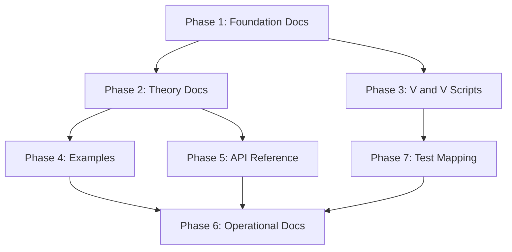

# UK_SSPA v2 — Final Documentation Implementation Plan

## Purpose

This plan provides step-by-step implementation tasks for building the complete documentation suite for the UK_SSPA v2 kriging program. Each task is scoped so that a single LLM session can execute it independently given the task description and access to the codebase.

Tasks are categorized as:
- **DOC** — Prose documentation
- **V&V** — Verification and Validation (benchmarks with pass/fail criteria against known analytical or numerical truth)
- **EXAMPLE** — Illustrative usage example (demonstrates features, not a formal validation)

---

## Conventions and Orientation Reference

### Coordinate System and Angle Convention

The codebase uses the following orientation conventions, which **must** be documented explicitly in every relevant section:

| Property | Convention | Reference |
|---|---|---|
| Coordinate system | Cartesian X-Y, units match input shapefile CRS | All modules |
| Angle definition | **Arithmetic**: Counter-Clockwise from East (positive X-axis) | [`variogram.py`](variogram.py), [`transform.py`](transform.py) |
| Angle = 0° | Points along the **positive X-axis** (East) | [`transform.py`](transform.py) |
| Angle = 90° | Points along the **positive Y-axis** (North) | Implied by CCW convention |
| Anisotropy ratio | `minor_range / major_range`, constrained to `(0, 1]` | [`variogram.py`](variogram.py) |
| Major axis alignment | After rotation by `angle_major`, the major axis aligns with the **X-axis** in model space | [`transform.py-51`](transform.py) |
| Scaling direction | The **Y-axis** (minor axis in model space) is stretched by `1/ratio` to make the field isotropic | [`transform.py-53`](transform.py) |
| Transform order | Translate to centroid → Rotate → Scale | [`transform.py`](transform.py) |

### Coordinate Spaces

| Space | Description | When Used |
|---|---|---|
| **Raw space** | Original coordinates from input shapefiles | Data loading, output generation, grid definition |
| **Model space** | Coordinates after anisotropy transformation (translate, rotate, scale) | Kriging training, polynomial drift computation, prediction |

### Key Terminology

| Term | Canonical Meaning |
|---|---|
| Observation wells | Primary point data with measured water levels |
| Control points | Synthetic points generated along line features (rivers) with interpolated elevations |
| Linesink | An Analytic Element Method (AEM) line segment that generates a potential field used as a drift term |
| Drift term | A deterministic trend function subtracted from the kriging residual (polynomial or AEM-based) |
| Rescaling factor (`resc`) | A scaling constant applied to drift terms for numerical stability; computed as `sqrt(sill / max_radius²)` with a safety floor at `variogram_range²` |
| Scaling factors (AEM) | Per-linesink-group multipliers that normalize the raw AEM potential to be comparable to the variogram sill; must be persisted from training to prediction |
| `term_names` | Ordered list of drift column identifiers; polynomial terms use fixed names (`linear_x`, `linear_y`, `quadratic_x`, `quadratic_y`); AEM terms use the `group_column` value from the shapefile |

---

## Task List

### Phase 1: Foundation Documents

#### Task 1.1 — Glossary and Conventions (DOC)
**File:** `docs/glossary.md`

Write a glossary document containing:
1. All entries from the "Key Terminology" table above
2. The complete "Coordinate System and Angle Convention" table above, with a diagram showing angle=0° pointing East, angle=90° pointing North
3. The "Coordinate Spaces" table explaining raw vs model space
4. A note that all angles in this tool are **arithmetic** (CCW from East), NOT compass/azimuth (CW from North). Include a conversion formula: `compass = 90 - arithmetic` (mod 360)
5. Clarify that `anisotropy_ratio = minor_range / major_range` so ratio=0.5 means the minor range is half the major range
6. Explain that the grid is defined in **raw space** but transformed to model space internally for prediction

**Acceptance:** A reader can determine the meaning of any domain term and the orientation of any angle without consulting source code.

---

#### Task 1.2 — Configuration Reference (DOC)
**File:** `docs/configuration.md`

Document every configuration key in [`config.json`](config.json) using the following table format for each section:

| Key Path | Type | Required | Default | Allowed Values | Description | Interactions |
|---|---|---|---|---|---|---|

Sections to document:
1. `data_sources.observation_wells` — `path` (str, required), `water_level_col` (str, required)
2. `data_sources.linesink_river` — `path`, `group_column`, `strength_col`, `rescaling_method` ("adaptive" or "fixed"), `control_points` sub-object (enabled, spacing, z_start_col, z_end_col, nugget_override, avoid_vertices, perpendicular_offset)
3. `variogram` — `model` (spherical/exponential/gaussian/linear), `sill`, `range`, `nugget`, `anisotropy` sub-object (enabled, ratio, angle_major), `advanced` sub-object (search_radius, max_neighbors, min_neighbors, effective_range_convention)
4. `drift_terms` — `linear_x`, `linear_y`, `quadratic_x`, `quadratic_y` (all bool), `linesink_river` (bool or dict with `use` and `apply_anisotropy`)
5. `grid` — `x_min`, `x_max`, `y_min`, `y_max`, `resolution`
6. `min_separation_distance` — float
7. `output` — `generate_map`, `export_contours`, `contour_interval`, `contour_output_path`, `export_points`, `points_output_path`
8. `cross_validation` — `enabled`

Include:
- A minimal config example (ordinary kriging, no drift, no anisotropy)
- A full-featured config example (anisotropy + linesink drift + polynomial drift + contour export)
- A decision table for `drift_terms.linesink_river` showing behavior when it is `true`, `false`, or `{"use": true, "apply_anisotropy": false}`

Source: [`config.json`](config.json), [`data.py-128`](data.py), [`variogram.py-52`](variogram.py), [`main.py-391`](main.py)

---

#### Task 1.3 — Workflow Reference (DOC)
**File:** `docs/workflow.md`

Document the complete execution pipeline from [`main.py-520`](main.py) as a numbered sequence of stages. For each stage, document:

| Stage | Function(s) Called | Inputs | Outputs | Coordinate Space | Failure Modes |
|---|---|---|---|---|---|

Stages:
1. Configuration loading — [`load_config()`](data.py)
2. Variogram initialization — [`variogram()`](variogram.py)
3. Observation well loading — [`load_observation_wells()`](data.py) 
4. Optional control point loading — [`load_line_features()`](data.py) for each non-observation source
5. Data preparation and merging — [`prepare_data()`](data.py)
6. Coordinate transformation (conditional on `anisotropy.enabled`) — [`get_transform_params()`](transform.py), [`apply_transform()`](transform.py)
7. Polynomial drift computation — [`compute_resc()`](drift.py), [`compute_polynomial_drift()`](drift.py)
8. AEM linesink drift computation (conditional) — [`compute_linesink_drift_matrix()`](AEM_drift.py)
9. Drift matrix merging — `np.hstack([poly, aem])`
10. Model building — [`build_uk_model()`](kriging.py)
11. Diagnostics — [`drift_diagnostics()`](drift.py), [`verify_drift_physics()`](drift.py), [`diagnose_kriging_system()`](main.py)
12. Cross-validation (conditional) — [`cross_validate()`](kriging.py)
13. Grid prediction — [`predict_on_grid()`](kriging.py)
14. Output generation — [`generate_map()`](main.py), [`export_contours()`](main.py), [`export_aux_points()`](main.py)

Include the Mermaid flowchart from the review document, enhanced with coordinate-space annotations on each node.

**Critical contracts to document:**
- `term_names` order must be identical between training and prediction
- AEM `scaling_factors` from training must be passed to [`predict_on_grid()`](kriging.py) via `scaling_factors` parameter
- When `apply_anisotropy=false` for linesink drift, raw coordinates are used for AEM computation even though model coordinates are used for polynomial drift and kriging
- The variogram object is cloned with `anisotropy_enabled=False` before passing to PyKrige when pre-transformation is used

---

#### Task 1.4 — Data Contracts (DOC)
**File:** `docs/data-contracts.md`

Document the exact input data requirements for each source type:

**Observation Wells Shapefile:**
- Geometry type: Point
- Required columns: the column named in `water_level_col` (numeric, no nulls)
- CRS: must be consistent with all other inputs (tool does not reproject)

**Linesink River Shapefile (for AEM drift):**
- Geometry type: LineString or MultiLineString
- Required columns: `group_column` (string, groups segments into named linesinks), `strength_col` (numeric, default column name "resistance")
- Optional control point columns: `z_start_col`, `z_end_col` (numeric, for interpolating synthetic control point elevations)
- CRS: must match observation wells

**Output Artifacts:**
- Contour shapefile: LineString geometry, written to `contour_output_path`
- Auxiliary points shapefile: Point geometry with x, y, h columns
- Map: matplotlib figure (displayed or saved depending on config)

Document null handling, duplicate handling (via [`remove_duplicate_points()`](data.py) with `min_separation_distance`), and what happens when optional inputs are missing.

---

### Phase 2: Theory and Technical Reference

#### Task 2.1 — Variogram Models Reference (DOC)
**File:** `docs/theory/variogram-models.md`

Document each supported variogram model with its mathematical equation, referencing [`variogram.py-81`](variogram.py):

1. **Linear:** `γ(h) = nugget + (psill/range) * h` for `h ≤ range`, else `sill`
2. **Exponential:** `γ(h) = nugget + psill * (1 - exp(-h / (range/3)))`
3. **Spherical:** `γ(h) = nugget + psill * (1.5*(h/range) - 0.5*(h/range)³)` for `h ≤ range`, else `sill`
4. **Gaussian:** `γ(h) = nugget + psill * (1 - exp(-(h/(range/√3))²))`

Where `psill = sill - nugget`.

Include a plot showing all four models with the same sill=1, range=100, nugget=0.1.

Document the `effective_range_convention` parameter and its effect.

---

#### Task 2.2 — Anisotropy Theory and Implementation (DOC)
**File:** `docs/theory/anisotropy.md`

Document:
1. What geometric anisotropy means physically (directional dependence of spatial correlation)
2. The pre-transformation approach: coordinates are transformed to make the field isotropic, then isotropic kriging is applied
3. The transformation formula: `X' = S * (R * (X - center))` from [`transform.py`](transform.py)
4. Step-by-step: translate to centroid, rotate by `angle_major` (CCW from East), scale Y by `1/ratio`
5. **Explicitly state:** angle_major=0° means the major axis of correlation points East; angle_major=45° means it points NE
6. The inverse transform for converting model-space results back to raw space: [`invert_transform_coords()`](transform.py)
7. Why PyKrige's internal anisotropy is disabled after pre-transformation (to avoid double-application)
8. The `apply_anisotropy` toggle for linesink drift and what it means physically

Include a diagram showing a point cloud before and after transformation for angle=30°, ratio=0.5.

---

#### Task 2.3 — Polynomial Drift Theory (DOC)
**File:** `docs/theory/polynomial-drift.md`

Document:
1. Universal Kriging formulation: `Z(x) = m(x) + ε(x)` where `m(x)` is the drift (trend) and `ε(x)` is the residual
2. Supported polynomial terms and their formulas:
   - `linear_x`: `D = resc * x`
   - `linear_y`: `D = resc * y`
   - `quadratic_x`: `D = resc * x²`
   - `quadratic_y`: `D = resc * y²`
3. The rescaling factor `resc` computation from [`compute_resc()`](drift.py): `resc = sqrt(sill / max(radsqd, range²))`
4. Why rescaling is necessary (numerical stability of the kriging matrix)
5. The safety floor: `radsqd` is floored at `range²` to prevent instability when data extent is small relative to correlation range
6. Term ordering contract: always `[linear_x, linear_y, quadratic_x, quadratic_y]` regardless of config dict order
7. The drift verification system from [`verify_drift_physics()`](drift.py): R² checks and slope/curvature checks

---

#### Task 2.4 — AEM Linesink Drift Theory (DOC)
**File:** `docs/theory/aem-linesink.md`

Document:
1. The Analytic Element Method concept: line sinks generate a potential field that represents the hydraulic influence of a river
2. The complex potential formula from [`compute_linesink_potential()`](AEM_drift.py):
   - Map to ZZ space: `ZZ = (z - mid) / half_L_vec` where `z = x + iy`, `mid = (z1+z2)/2`, `half_L_vec = (z2-z1)/2`
   - Complex potential: `carg = (ZZ+1)ln(ZZ+1) - (ZZ-1)ln(ZZ-1) + 2ln(half_L_vec) - 2`
   - Real potential: `φ = (strength * L / 4π) * Re(carg)`
3. Singularity handling at endpoints (ZZ near ±1)
4. Segment grouping: segments sharing the same `group_column` value are summed into one drift term
5. Rescaling methods:
   - **Adaptive** (default): `rescr = sill / max(|φ|)` — normalizes each group's potential to the variogram sill
   - **Fixed**: `rescr = sill / 0.0001` — KT3D-style constant scaling
6. The critical contract: scaling factors computed during training **must** be reused during prediction via `input_scaling_factors`
7. The `apply_anisotropy` toggle: when `true`, linesink geometry is transformed to model space; when `false`, raw coordinates are used for AEM computation
8. Reference: Strack, O. D. L. (1989). *Groundwater Mechanics*. Prentice Hall.

Include a diagram showing a single linesink segment with labeled endpoints z1, z2, midpoint, and the ZZ mapping.

---

### Phase 3: Verification and Validation

Each V&V task produces a self-contained Python script in `docs/validation/` that:
- Uses deterministic random seeds
- Prints PASS/FAIL with numerical tolerances
- Generates comparison plots saved to `docs/validation/output/`

#### Task 3.1 — V&V: Variogram Model Equations (V&V)
**File:** `docs/validation/vv_variogram_models.py`

**Objective:** Verify that each variogram model in [`variogram.py`](variogram.py) produces correct semivariance values against hand-calculated analytical values.

**Test cases:**
1. For each model (spherical, exponential, gaussian, linear) with sill=10, range=100, nugget=1:
   - Verify `γ(0) = 0` (or nugget behavior at h→0)
   - Verify `γ(range) ≈ sill` (within model-specific tolerance)
   - Verify `γ(2*range) = sill` for bounded models (spherical, linear)
   - Verify `γ(range/2)` against hand-calculated value
2. Verify nugget validation: sill=1, nugget=1.5 raises `ValueError`
3. Verify range validation: range=-10 raises `ValueError`

**Tolerances:** Absolute difference < 1e-10 for analytical comparisons.

**Pass criteria:** All assertions pass. Script prints summary table of model, h, expected, actual, |error|, PASS/FAIL.

---

#### Task 3.2 — V&V: Coordinate Transformation Roundtrip (V&V)
**File:** `docs/validation/vv_transform_roundtrip.py`

**Objective:** Verify that [`apply_transform()`](transform.py) followed by [`invert_transform_coords()`](transform.py) recovers original coordinates exactly.

**Test cases:**
1. Random point cloud (N=50, seed=42), angle=0°, ratio=1.0 (identity transform)
2. Random point cloud, angle=45°, ratio=0.5
3. Random point cloud, angle=90°, ratio=0.3
4. Random point cloud, angle=0°, ratio=0.5 (pure scaling, no rotation)
5. Single point at origin
6. Points along a line (collinear)

**Tolerances:** Max absolute roundtrip error < 1e-12.

**Additional checks:**
- Verify that after forward transform with angle=0°, ratio=0.5, the Y-coordinates are scaled by 2x relative to X
- Verify that after forward transform with angle=90°, ratio=1.0, the X and Y coordinates are swapped (with sign)
- Document the orientation: "angle_major=0 means major axis along East (positive X). After rotation, major axis aligns with X-axis in model space."

---

#### Task 3.3 — V&V: Polynomial Drift Computation (V&V)
**File:** `docs/validation/vv_polynomial_drift.py`

**Objective:** Verify that [`compute_polynomial_drift()`](drift.py) produces mathematically correct drift columns.

**Test cases:**
1. **Linear X verification:** Given x=[0, 10, 20], y=[0, 0, 0], resc=0.5, verify `drift[:,0] = [0, 5, 10]`
2. **Linear Y verification:** Given x=[0, 0, 0], y=[0, 10, 20], resc=0.5, verify `drift[:,0] = [0, 5, 10]`
3. **Quadratic X verification:** Given x=[0, 10, 20], resc=0.5, verify `drift[:,0] = [0, 50, 200]`
4. **Quadratic Y verification:** Given y=[0, 10, 20], resc=0.5, verify `drift[:,0] = [0, 50, 200]`
5. **Term ordering:** Enable all four terms in different config dict orderings; verify output column order is always `[linear_x, linear_y, quadratic_x, quadratic_y]`
6. **Rescaling factor:** Verify [`compute_resc()`](drift.py) with known inputs:
   - x=[0, 100], y=[0, 100], sill=1.0, range=50 → `radsqd = 10000`, `safe_radsqd = max(10000, 2500) = 10000`, `resc = sqrt(1/10000) = 0.01`
   - x=[0, 1], y=[0, 1], sill=1.0, range=1000 → safety floor triggers: `safe_radsqd = 1000000`, `resc = sqrt(1/1000000) = 0.001`

**Tolerances:** Exact match (< 1e-14 absolute difference).

**Pass criteria:** All computed values match analytical expectations.

---

#### Task 3.4 — V&V: Drift Physics Verification System (V&V)
**File:** `docs/validation/vv_drift_physics.py`

**Objective:** Verify that [`verify_drift_physics()`](drift.py) correctly identifies valid and invalid drift columns.

**Test cases:**
1. **Valid linear_x:** Construct `drift_col = resc * x` and verify function returns "PASS"
2. **Valid quadratic_y:** Construct `drift_col = resc * y²` and verify function returns "PASS"
3. **Corrupted linear_x:** Construct `drift_col = resc * x + random_noise(scale=resc*x*0.1)` and verify function returns "FAIL" (R² < 0.999 or slope error > 1%)
4. **Wrong scaling:** Construct `drift_col = 2*resc * x` and verify function returns "FAIL" (slope error > 1%)
5. **AEM term (non-polynomial):** Verify function returns "SKIP" for term names not containing `_x` or `_y`

**Tolerances:** Function's own internal thresholds (R² > 0.999, slope error < 1%).

---

#### Task 3.5 — V&V: AEM Linesink Potential — Single Segment Analytical Check (V&V)
**File:** `docs/validation/vv_aem_single_segment.py`

**Objective:** Verify [`compute_linesink_potential()`](AEM_drift.py) against hand-calculated values for simple geometries.

**Test cases:**
1. **Segment along X-axis:** z1=(0,0), z2=(100,0), strength=1.0
   - Evaluate at (50, 50) — point above midpoint
   - Evaluate at (50, -50) — point below midpoint (should be symmetric)
   - Evaluate at (200, 0) — point far from segment
   - Evaluate at (50, 0.001) — point very near the segment centerline
2. **Symmetry check:** For a segment centered at origin along X-axis, verify potential is symmetric about the segment axis: `φ(x, y) = φ(x, -y)`
3. **Superposition check:** Verify that potential from two collinear segments [0,50] + [50,100] equals potential from one segment [0,100] (within tolerance)
4. **Zero-length segment:** Verify that a segment with L < 1e-6 returns zeros
5. **Strength scaling:** Verify `φ(strength=2) = 2 * φ(strength=1)` exactly

**Tolerances:** Symmetry: < 1e-10. Superposition: < 1e-6 (due to endpoint singularity handling). Strength linearity: < 1e-14.

---

#### Task 3.6 — V&V: AEM Drift Matrix Scaling Consistency (V&V)
**File:** `docs/validation/vv_aem_scaling_consistency.py`

**Objective:** Verify that AEM drift scaling factors from training are correctly reused during prediction via [`compute_linesink_drift_matrix()`](AEM_drift.py).

**Test cases:**
1. Create a simple linesink GeoDataFrame with 2 groups, each with 1 segment
2. Compute drift matrix at training points (N=10) with `rescaling_method='adaptive'` → get `scaling_factors`
3. Compute drift matrix at different prediction points (N=20) passing `input_scaling_factors=scaling_factors`
4. **Verify:** The scaling factors used in prediction match those from training exactly
5. **Verify:** If `input_scaling_factors` is NOT passed, the prediction scaling factors differ (because max potential differs at different points)
6. **Verify fixed method:** With `rescaling_method='fixed'`, scaling factor equals `sill / 0.0001` regardless of data

**Tolerances:** Exact match for factor reuse (< 1e-15).

---

#### Task 3.7 — V&V: Wrapper Equivalence — No Drift Path (V&V)
**File:** `docs/validation/vv_wrapper_no_drift.py`

**Objective:** Verify that [`build_uk_model()`](kriging.py) with an empty drift matrix produces results equivalent to direct `pykrige.uk.UniversalKriging` with no specified drift.

**Setup:**
- Synthetic dataset: 20 points, seed=42, z = random field with known variogram (spherical, sill=1, range=50, nugget=0.1)
- Grid: 10x10

**Comparison:**
1. Our wrapper: `build_uk_model(x, y, z, drift_matrix=np.zeros((20,0)), variogram_obj)` → predict on grid
2. Direct PyKrige: `UniversalKriging(x, y, z, variogram_model='spherical', variogram_parameters={'sill':1, 'range':50, 'nugget':0.1})` → predict on same grid

**Metrics:** Max absolute difference in predictions and variances.

**Tolerances:** < 1e-10 for both predictions and variances.

**Pass criteria:** Wrapper produces identical results to direct PyKrige when no drift is specified.

---

#### Task 3.8 — V&V: Specified Polynomial Drift — Synthetic Truth Recovery (V&V)
**File:** `docs/validation/vv_polynomial_drift_recovery.py`

**Objective:** Verify that Universal Kriging with polynomial drift can recover a known linear trend from synthetic data.

**Setup:**
- Generate 30 points (seed=42) with `z = 0.5*x + 0.3*y + N(0, 0.1)`
- Variogram: spherical, sill=0.1, range=50, nugget=0.01

**Test:**
1. Run our full pipeline: compute `resc`, compute polynomial drift (linear_x + linear_y), build UK model, predict on grid
2. Run direct PyKrige with `specified_drift_arrays` using the same drift columns
3. Compare predicted surfaces

**Metrics:**
- Max absolute difference between our predictions and PyKrige's
- RMSE of predicted surface vs true trend `0.5*x + 0.3*y` (should be small)

**Tolerances:** Our vs PyKrige: < 1e-8. Trend recovery RMSE: < 0.5 (noise-limited).

**Pass criteria:** Our wrapper matches direct PyKrige specified-drift exactly, and both recover the true trend within noise bounds.

---

#### Task 3.9 — V&V: Anisotropy Pre-Transform Consistency (V&V)
**File:** `docs/validation/vv_anisotropy_consistency.py`

**Objective:** Verify that our pre-transformation anisotropy approach produces equivalent results to PyKrige's internal anisotropy handling.

**Setup:**
- 25 points (seed=42) with anisotropic spatial structure
- Variogram: spherical, sill=1, range=100, nugget=0.1, angle=30° (CCW from East), ratio=0.4

**Comparison:**
1. **Our approach:** Transform coordinates via [`get_transform_params()`](transform.py) + [`apply_transform()`](transform.py), then run isotropic PyKrige (anisotropy disabled)
2. **PyKrige internal:** Pass raw coordinates with `anisotropy_scaling=ratio, anisotropy_angle=angle` to PyKrige

**Important angle note:** PyKrige uses **CCW from East** for `anisotropy_angle`, which matches our convention. Document this explicitly.

**Metrics:** Max absolute difference in predictions at 50 test points.

**Tolerances:** < 1e-6 (small differences possible due to centroid-based vs origin-based rotation).

**Additional checks:**
- Verify transformed coordinates have expected properties: major axis aligned with X, minor axis stretched
- Test at angle=0°, 45°, 90° with ratio=0.5

---

#### Task 3.10 — V&V: LOOCV Diagnostic Metrics (V&V)
**File:** `docs/validation/vv_loocv.py`

**Objective:** Verify that [`cross_validate()`](kriging.py) produces correct leave-one-out statistics.

**Setup:**
- 15 points (seed=42), simple linear trend + noise
- No drift (ordinary kriging path) for simplicity

**Test cases:**
1. Verify that `n` predictions are produced for `n` input points
2. Verify that each prediction excludes the held-out point (by checking that prediction at held-out location differs from observed value when nugget > 0)
3. Verify RMSE calculation: `sqrt(mean((pred - obs)²))`
4. Verify MAE calculation: `mean(|pred - obs|)`
5. Verify Q1 (mean standardized error) and Q2 (variance of standardized errors) are computed
6. Verify that with < 3 points, function returns NaN metrics gracefully

**Tolerances:** Metric calculations exact to < 1e-12.

---

### Phase 4: Usage Examples

#### Task 4.1 — EXAMPLE: Ordinary Kriging (No Drift) (EXAMPLE)
**File:** `docs/examples/ex_ordinary_kriging.py`
**Companion doc:** `docs/examples/ex_ordinary_kriging.md`

Demonstrate the simplest use case:
- 20 synthetic points with spatial correlation
- Spherical variogram, no anisotropy, no drift terms
- Predict on a 50x50 grid
- Generate a prediction map and variance map
- Show the minimal `config.json` required

**Output:** Two matplotlib figures (prediction surface, variance surface) saved as PNG.

---

#### Task 4.2 — EXAMPLE: Universal Kriging with Linear Drift (EXAMPLE)
**File:** `docs/examples/ex_linear_drift.py`
**Companion doc:** `docs/examples/ex_linear_drift.md`

Demonstrate modeling a regional groundwater gradient:
- 30 synthetic points with `z = 0.5*x + noise`
- Enable `linear_x: true`
- Show the drift matrix and explain what each column represents
- Compare prediction with and without drift enabled
- Show the `verify_drift_physics()` output and explain PASS/FAIL

---

#### Task 4.3 — EXAMPLE: Incorporating River Effects with AEM Linesink Drift (EXAMPLE)
**File:** `docs/examples/ex_linesink_drift.py`
**Companion doc:** `docs/examples/ex_linesink_drift.md`

Demonstrate the AEM linesink drift feature:
- Create a synthetic river (LineString shapefile) with 3 segments
- 25 observation points with water levels influenced by proximity to river
- Enable `linesink_river: {"use": true, "apply_anisotropy": true}`
- Show the raw AEM potential field before and after scaling
- Show the combined drift matrix (polynomial + AEM)
- Explain the `trained_scaling_factors` and why they must persist to prediction

---

#### Task 4.4 — EXAMPLE: Anisotropy Handling (EXAMPLE)
**File:** `docs/examples/ex_anisotropy.py`
**Companion doc:** `docs/examples/ex_anisotropy.md`

Demonstrate anisotropy:
- 30 synthetic points with directional spatial structure (major axis at 45° from East)
- Show the raw point cloud and the transformed point cloud side by side
- **Explicitly label** the angle convention: "angle_major=45° means the major axis of spatial correlation points NE (45° counter-clockwise from East)"
- Show prediction with and without anisotropy
- Show the variogram clone with `anisotropy_enabled=False` and explain why

---

#### Task 4.5 — EXAMPLE: Full Pipeline with Real Test Data (EXAMPLE) ✅ SKIPPED — CONFIDENTIAL DATA
**File:** `docs/examples/ex_full_pipeline.py`
**Companion doc:** `docs/examples/ex_full_pipeline.md`

> **NOTE:** This task has been marked complete and skipped. The [`Test/Test01/`](Test/Test01/) dataset contains confidential data and cannot be used in public-facing documentation examples.

---

### Phase 5: API Reference

#### Task 5.1 — API Reference: data.py (DOC)
**File:** `docs/api/data.md`

Document all public functions in [`data.py`](data.py):
- [`load_config()`](data.py) — parameters, return type, exceptions, validation rules
- [`remove_duplicate_points()`](data.py) — parameters, algorithm, return type
- `load_observation_wells()` — parameters, return type, coordinate space (raw)
- `load_line_features()` — parameters, return type (4-tuple: cx, cy, ch, cn), coordinate space (raw)
- `prepare_data()` — parameters, merging logic, return type

For each function: parameter types, shapes, coordinate space assumptions, exceptions raised, side effects.

---

#### Task 5.2 — API Reference: variogram.py (DOC)
**File:** `docs/api/variogram.md`

Document the [`variogram`](variogram.py) class:
- Constructor parameters (config dict or config_path)
- All attributes: `model_type`, `sill`, `range_`, `nugget`, `anisotropy_enabled`, `anisotropy_ratio`, `angle_major`, advanced params
- Validation rules from [`_validate_basic_parameters()`](variogram.py), [`_validate_anisotropy()`](variogram.py)
- Methods: `calculate_variogram(h)`, `calculate_variogram_at_vector(hx, hy)`, `clone()`
- **Angle convention note:** `angle_major` is arithmetic (CCW from East), 0° = East

---

#### Task 5.3 — API Reference: transform.py (DOC)
**File:** `docs/api/transform.md`

Document:
- [`get_transform_params()`](transform.py) — inputs (x, y arrays + angle + ratio), output dict structure (`center`, `R`, `S`)
- [`apply_transform()`](transform.py) — formula `X' = S * (R * (X - center))`, input/output coordinate spaces
- [`invert_transform_coords()`](transform.py) — inverse formula, when to use
- **Orientation diagram:** Show the rotation matrix for angle=0°, 45°, 90° with example points

---

#### Task 5.4 — API Reference: drift.py (DOC)
**File:** `docs/api/drift.md`

Document:
- [`compute_resc()`](drift.py) — formula, safety floor, inputs/outputs
- [`compute_polynomial_drift()`](drift.py) — config parsing, term ordering contract, return shapes
- [`compute_drift_at_points()`](drift.py) — prediction-time drift reconstruction
- [`drift_diagnostics()`](drift.py) — what it checks, warning thresholds
- [`verify_drift_physics()`](drift.py) — R² and slope/curvature checks, pass/fail criteria

---

#### Task 5.5 — API Reference: AEM_drift.py (DOC)
**File:** `docs/api/aem_drift.md`

Document:
- [`compute_linesink_potential()`](AEM_drift.py) — complex potential formula, singularity handling, strength scaling
- [`compute_linesink_drift_matrix()`](AEM_drift.py) — all parameters including `input_scaling_factors`, `apply_anisotropy`, `rescaling_method`; return value (3-tuple: matrix, names, factors)
- **Critical contract:** scaling factors must be persisted and reused
- Coordinate space behavior based on `apply_anisotropy` flag

---

#### Task 5.6 — API Reference: kriging.py (DOC)
**File:** `docs/api/kriging.md`

Document:
- [`build_uk_model()`](kriging.py) — how it wraps PyKrige, drift_terms="specified" convention, anisotropy handling
- [`predict_at_points()`](kriging.py) — drift column count validation, PyKrige version compatibility
- [`predict_on_grid()`](kriging.py) — grid generation, coordinate transformation, drift reconstruction logic, the `scaling_factors` parameter
- [`output_drift_coefficients()`](kriging.py) — OLS diagnostic, non-intrusive
- [`cross_validate()`](kriging.py) — LOOCV algorithm, per-fold resc recomputation, return dict structure

---

### Phase 6: Operational Documents

#### Task 6.1 — Troubleshooting Guide (DOC) ✅ NOT NEEDED — SKIPPED

> **NOTE:** This task has been marked as not needed and skipped.

---

#### Task 6.2 — Quickstart Guide (DOC)
**File:** `docs/quickstart.md`

Write a minimal end-to-end guide:
1. Install dependencies: `pip install numpy pandas geopandas shapely scipy matplotlib pykrige`
2. Prepare a minimal config.json (ordinary kriging, no drift)
3. Prepare a point shapefile with water level column
4. Run: `python main.py`
5. Expected output: log messages showing each pipeline stage, optional map/contour files
6. Show expected log milestones (configuration loaded, data prepared, model built, prediction complete)

---

#### Task 6.3 — Overview and Introduction (DOC)
**File:** `docs/overview.md`

Write the project overview:
1. What UK_SSPA v2 does (Universal Kriging with specified drift for spatial water level mapping)
2. Key capabilities: polynomial drift, AEM linesink drift, anisotropy, LOOCV, grid prediction, contour export
3. Target audience: hydrogeologists, spatial analysts
4. Architecture summary: config-driven pipeline, modular design
5. Link to all other documentation sections

---

### Phase 7: Test-to-Documentation Mapping

#### Task 7.1 — Tested Behaviors Catalog (DOC)
**File:** `docs/validation/tested-behaviors.md`

Create a mapping table from documented claims to existing test files:

| Claim | Test File | Test Function | Status |
|---|---|---|---|
| Variogram validates sill > 0 | [`test_variogram_v2_integration.py`](test_variogram_v2_integration.py) | `test_variogram_integration` | Covered |
| Drift term ordering is deterministic | [`test_drift.py`](test_drift.py) | `test_deterministic_ordering` | Covered |
| Drift training/prediction consistency | [`test_drift.py`](test_drift.py) | `test_consistency_training_prediction` | Covered |
| Coordinate transform roundtrip | [`test_anisotropy_transformation.py`](test_anisotropy_transformation.py) | `test_coordinate_transformation_logic` | Covered |
| Resc safety floor activates | [`test_drift.py`](test_drift.py) | `test_compute_resc_safety_floor` | Covered |
| PyKrige anisotropy disabled after pre-transform | [`test_anisotropy_transformation.py`](test_anisotropy_transformation.py) | `test_anisotropy_disabled_in_pykrige` | Covered |
| Build UK model with drift | [`test_kriging.py`](test_kriging.py) | `test_build_uk_model_with_drift` | Covered |
| Predict column mismatch raises error | [`test_kriging.py`](test_kriging.py) | `test_predict_at_points_column_mismatch` | Covered |
| LOOCV with small dataset | [`test_kriging.py`](test_kriging.py) | `test_cross_validate_small` | Covered |
| End-to-end integration | [`test_kriging_integration.py`](test_kriging_integration.py) | `test_kriging_integration_e2e` | Covered |
| Contour export | [`test_main.py`](test_main.py) | `test_export_contours_valid` | Covered |
| Line feature loading | [`test_data.py`](test_data.py) | Multiple tests | Covered |

Identify gaps where V&V tasks (Phase 3) provide additional coverage not in existing tests.

---

## Execution Order Summary



**Dependencies:**
- Phase 1 (glossary, config, workflow, data contracts) must be completed first — all other phases reference these
- Phase 2 (theory) and Phase 3 (V&V) can proceed in parallel after Phase 1
- Phase 4 (examples) depends on Phase 2 for theory explanations
- Phase 5 (API reference) depends on Phase 2 for theory context
- Phase 6 (operational docs) depends on Phases 4, 5, and 7
- Phase 7 (test mapping) depends on Phase 3 V&V scripts being written

---

## Document Tree

```
docs/
├── overview.md                          (Task 6.3)
├── quickstart.md                        (Task 6.2)
├── glossary.md                          (Task 1.1)
├── configuration.md                     (Task 1.2)
├── workflow.md                          (Task 1.3)
├── data-contracts.md                    (Task 1.4)
├── troubleshooting.md                   (Task 6.1 — NOT NEEDED — SKIPPED)
├── theory/
│   ├── variogram-models.md              (Task 2.1)
│   ├── anisotropy.md                    (Task 2.2)
│   ├── polynomial-drift.md              (Task 2.3)
│   └── aem-linesink.md                  (Task 2.4)
├── api/
│   ├── data.md                          (Task 5.1)
│   ├── variogram.md                     (Task 5.2)
│   ├── transform.md                     (Task 5.3)
│   ├── drift.md                         (Task 5.4)
│   ├── aem_drift.md                     (Task 5.5)
│   └── kriging.md                       (Task 5.6)
├── examples/
│   ├── ex_ordinary_kriging.py           (Task 4.1)
│   ├── ex_ordinary_kriging.md           (Task 4.1)
│   ├── ex_linear_drift.py              (Task 4.2)
│   ├── ex_linear_drift.md              (Task 4.2)
│   ├── ex_linesink_drift.py            (Task 4.3)
│   ├── ex_linesink_drift.md            (Task 4.3)
│   ├── ex_anisotropy.py                (Task 4.4)
│   ├── ex_anisotropy.md                (Task 4.4)
│   ├── ex_full_pipeline.py             (Task 4.5 — SKIPPED: confidential data)
│   └── ex_full_pipeline.md             (Task 4.5 — SKIPPED: confidential data)
└── validation/
    ├── tested-behaviors.md              (Task 7.1)
    ├── vv_variogram_models.py           (Task 3.1 — V&V)
    ├── vv_transform_roundtrip.py        (Task 3.2 — V&V)
    ├── vv_polynomial_drift.py           (Task 3.3 — V&V)
    ├── vv_drift_physics.py              (Task 3.4 — V&V)
    ├── vv_aem_single_segment.py         (Task 3.5 — V&V)
    ├── vv_aem_scaling_consistency.py    (Task 3.6 — V&V)
    ├── vv_wrapper_no_drift.py           (Task 3.7 — V&V)
    ├── vv_polynomial_drift_recovery.py  (Task 3.8 — V&V)
    ├── vv_anisotropy_consistency.py     (Task 3.9 — V&V)
    ├── vv_loocv.py                      (Task 3.10 — V&V)
    └── output/                          (generated plots)
```

---

## Task Summary Table

| Task | Type | File | Depends On |
|---|---|---|---|
| 1.1 | DOC | `docs/glossary.md` | — |
| 1.2 | DOC | `docs/configuration.md` | 1.1 |
| 1.3 | DOC | `docs/workflow.md` | 1.1 |
| 1.4 | DOC | `docs/data-contracts.md` | 1.1 |
| 2.1 | DOC | `docs/theory/variogram-models.md` | 1.1 |
| 2.2 | DOC | `docs/theory/anisotropy.md` | 1.1 |
| 2.3 | DOC | `docs/theory/polynomial-drift.md` | 1.1 |
| 2.4 | DOC | `docs/theory/aem-linesink.md` | 1.1 |
| 3.1 | V&V | `docs/validation/vv_variogram_models.py` | 2.1 |
| 3.2 | V&V | `docs/validation/vv_transform_roundtrip.py` | 2.2 |
| 3.3 | V&V | `docs/validation/vv_polynomial_drift.py` | 2.3 |
| 3.4 | V&V | `docs/validation/vv_drift_physics.py` | 2.3 |
| 3.5 | V&V | `docs/validation/vv_aem_single_segment.py` | 2.4 |
| 3.6 | V&V | `docs/validation/vv_aem_scaling_consistency.py` | 2.4 |
| 3.7 | V&V | `docs/validation/vv_wrapper_no_drift.py` | 1.3 |
| 3.8 | V&V | `docs/validation/vv_polynomial_drift_recovery.py` | 2.3, 3.7 |
| 3.9 | V&V | `docs/validation/vv_anisotropy_consistency.py` | 2.2, 3.7 |
| 3.10 | V&V | `docs/validation/vv_loocv.py` | 1.3 |
| 4.1 | EXAMPLE | `docs/examples/ex_ordinary_kriging.*` | 2.1 |
| 4.2 | EXAMPLE | `docs/examples/ex_linear_drift.*` | 2.3 |
| 4.3 | EXAMPLE | `docs/examples/ex_linesink_drift.*` | 2.4 |
| 4.4 | EXAMPLE | `docs/examples/ex_anisotropy.*` | 2.2 |
| 4.5 | EXAMPLE | `docs/examples/ex_full_pipeline.*` | 1.2, 1.3 | ✅ SKIPPED — confidential data |
| 5.1 | DOC | `docs/api/data.md` | 1.4 |
| 5.2 | DOC | `docs/api/variogram.md` | 2.1 |
| 5.3 | DOC | `docs/api/transform.md` | 2.2 |
| 5.4 | DOC | `docs/api/drift.md` | 2.3 |
| 5.5 | DOC | `docs/api/aem_drift.md` | 2.4 |
| 5.6 | DOC | `docs/api/kriging.md` | 1.3 |
| 6.1 | DOC | `docs/troubleshooting.md` | 1.3 | ✅ NOT NEEDED — SKIPPED |
| 6.2 | DOC | `docs/quickstart.md` | 1.2 |
| 6.3 | DOC | `docs/overview.md` | All |
| 7.1 | DOC | `docs/validation/tested-behaviors.md` | 3.x |
