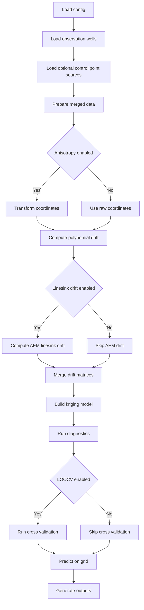

# Critical Review of `documentation_plan.md`

## Executive Summary

[`documentation_plan.md`](documentation_plan.md) is directionally useful but not yet strong enough to guide high-quality documentation for either human operators or agentic workflows. It reads like a generic documentation wishlist rather than an execution-ready documentation strategy grounded in the actual codebase.

The biggest problems are:

- it overstates documentation maturity without mapping to the real interfaces and workflow in [`main.py`](main.py), [`kriging.py`](kriging.py), [`data.py`](data.py), [`drift.py`](drift.py), [`AEM_drift.py`](AEM_drift.py), [`transform.py`](transform.py), and [`variogram.py`](variogram.py)
- it does not distinguish clearly between user-facing workflow docs, developer reference docs, and agent-facing operational docs
- it omits critical contracts, invariants, failure modes, and decision points that agents need in order to execute the tool safely and repeatably
- parts of the benchmarking section are technically weak or mismatched to the implementation
- it lacks a concrete documentation artifact structure, ownership model, and acceptance criteria

As written, the plan would likely produce documentation that is readable but operationally incomplete. Humans would still need to inspect code to understand edge cases, and agents would still lack the structured guidance needed to run the workflow reliably.

## What the Plan Gets Right

### 1. It identifies the correct major capability areas

The plan correctly recognizes that the system revolves around:

- universal kriging with specified drift
- polynomial drift
- AEM linesink drift
- anisotropy handling
- LOOCV
- grid prediction and contour generation

Those themes align with the actual orchestration in [`main.py`](main.py), model construction in [`build_uk_model`](kriging.py), grid prediction in [`predict_on_grid`](kriging.py), config validation in [`load_config`](data.py), and linesink drift generation in [`compute_linesink_drift_matrix`](AEM_drift.py).

### 2. It recognizes that theory and implementation both matter

Including both user guidance and technical reference is appropriate for this codebase because the implementation mixes:

- geospatial data handling
- numerical scaling
- kriging library integration
- domain-specific hydrogeologic drift logic

That combination requires both conceptual explanation and implementation-specific documentation.

### 3. It correctly treats benchmarking as part of documentation quality

For a scientific Python tool, documentation is not complete unless claims are tied to validation. The plan is right to include benchmarking and comparison work rather than treating docs as purely narrative.

## Critical Weaknesses

## 1. The plan is not grounded enough in the actual workflow entrypoint

The real workflow is not abstract. It is a concrete pipeline in [`main.py`](main.py):

1. load config
2. instantiate variogram
3. load observation wells
4. optionally load line-feature-derived control points
5. prepare merged data
6. optionally transform coordinates for anisotropy
7. compute polynomial drift
8. optionally compute linesink drift
9. merge drift matrices
10. build kriging model
11. run diagnostics and drift verification
12. optionally run LOOCV
13. predict on grid
14. generate outputs including maps, contours, and auxiliary points

[`documentation_plan.md`](documentation_plan.md) mentions many of these topics, but it does not document the workflow as an explicit stateful pipeline. That is a major gap.

Why this matters:

- human users need to know the exact order of operations and where configuration affects behavior
- agents need a deterministic execution graph with preconditions, outputs, and failure points at each stage

The plan should explicitly require a workflow document such as `docs/workflow.md` that describes each stage, inputs, outputs, side effects, and common failure modes.

## 2. It does not separate human documentation from agent documentation

This is the most important structural flaw.

The current plan assumes one documentation suite can serve everyone. In practice, this project needs at least three layers:

### A. Human operator docs

These should explain:

- what the tool does
- how to configure it
- how to prepare data
- how to interpret outputs
- how to troubleshoot common issues

### B. Developer/reference docs

These should explain:

- module responsibilities
- function signatures
- data flow between modules
- extension points
- test coverage and assumptions

### C. Agentic execution docs

These should explain:

- canonical entrypoints
- required config contracts
- exact file dependencies
- deterministic execution sequence
- machine-checkable assumptions
- expected artifacts and validation checks
- safe fallback behavior when optional inputs are missing

[`documentation_plan.md`](documentation_plan.md) only partially covers A and B, and almost completely misses C.

For agentic workflows, the docs should include explicit sections like:

- execution contract
- config schema and required keys
- artifact contract
- failure taxonomy
- decision table for drift and anisotropy combinations
- reproducibility checklist

Without those, an agent still has to reverse-engineer behavior from code.

## 3. The plan under-specifies configuration documentation

The plan says there should be a deep dive into [`config.json`](config.json), but that is not enough. This project needs a formal configuration contract.

The code already enforces some required keys in [`load_config`](data.py):

- `data_sources`
- `variogram`
- `drift_terms`
- `grid`

But the runtime behavior in [`main.py`](main.py) and [`predict_on_grid`](kriging.py) depends on more than just those top-level keys. There are nested conventions and optional branches, including:

- observation well source structure
- line feature source structure
- linesink-specific source keys such as path, group column, strength column, and rescaling method
- drift term toggles that may be booleans or nested dicts
- cross-validation toggles
- output toggles and output paths
- anisotropy nested settings under `variogram`

The plan should require:

- a complete config schema table
- required vs optional keys
- type constraints
- default values
- semantic meaning
- interactions between keys
- invalid combinations
- example minimal configs and advanced configs

For agentic use, this should ideally be backed by a machine-readable schema file, not just prose.

## 4. It misses the most important operational nuance: branch behavior

This codebase has meaningful behavioral branches that documentation must make explicit.

Examples:

- anisotropy may be handled by pre-transforming coordinates and disabling anisotropy in the kriging object, as shown in [`main.py`](main.py) and [`build_uk_model`](kriging.py)
- linesink drift can be enabled as a boolean or configured as a dict with `use` and `apply_anisotropy`, as shown in [`main.py`](main.py)
- linesink scaling can be `adaptive` or `fixed`, as shown in [`compute_linesink_drift_matrix`](AEM_drift.py)
- prediction reconstructs drift terms from `term_names`, and non-polynomial terms are assumed to be AEM linesink terms in [`predict_on_grid`](kriging.py)

These are not minor implementation details. They are core behavioral contracts.

The plan should require decision tables documenting combinations such as:

| Condition | Behavior | Risks | Required docs |
|---|---|---|---|
| anisotropy enabled | coordinates transformed before kriging | mismatch if raw and transformed spaces are mixed | transformation workflow |
| linesink drift enabled with `apply_anisotropy=true` | river geometry transformed into model space | conceptual confusion about physical vs model space | branch-specific examples |
| linesink drift enabled with `apply_anisotropy=false` | river geometry kept in raw space | prediction/training mismatch risk if misunderstood | explicit contract |
| no drift terms | ordinary kriging path | users may still expect universal kriging behavior | ordinary kriging example |

This kind of documentation is essential for both humans and agents.

## 5. The plan ignores failure modes and troubleshooting depth

The code contains many validation and failure points, but the plan does not require a troubleshooting guide tied to actual runtime behavior.

Examples visible in code:

- missing or invalid config file in [`load_config`](data.py)
- invalid variogram numeric constraints in [`load_config`](data.py)
- invalid grid definitions in [`predict_on_grid`](kriging.py)
- missing or invalid linesink shapefile path in [`main.py`](main.py)
- drift mismatch risks during prediction in [`predict_at_points`](kriging.py)
- insufficient points for LOOCV in [`cross_validate`](kriging.py)

The plan should explicitly require:

- an error catalog
- likely causes
- remediation steps
- whether the failure is fatal, recoverable, or warning-only
- examples of log messages and what they mean

Agentic workflows especially need this because agents must decide whether to retry, repair config, skip optional branches, or stop.

## 6. The API reference section is too shallow and slightly misleading

The plan lists key modules, but it does not define what kind of API reference is needed.

For this project, a useful API reference must include more than signatures. It must document:

- expected array shapes
- coordinate space assumptions
- whether inputs are raw-space or model-space
- whether outputs are stable across training and prediction phases
- side effects such as file I/O and plotting
- hidden coupling between functions

Examples of coupling that must be documented:

- [`build_uk_model`](kriging.py) expects drift columns in a specific order that must be preserved into prediction
- [`predict_on_grid`](kriging.py) reconstructs drift from `term_names`, so term naming is part of the contract
- [`compute_linesink_drift_matrix`](AEM_drift.py) returns scaling factors that must be reused during prediction for consistency
- [`variogram`](variogram.py) and [`load_config`](data.py) both validate overlapping concepts, which should be documented to avoid duplicated or conflicting assumptions

Without documenting these contracts, the API reference will be too weak for extension or automation.

## 7. The plan does not account for documentation of outputs as artifacts

The workflow produces artifacts, not just in-memory results. The plan mentions maps and contours, but it does not define output contracts.

The docs should specify:

- what files may be created
- under what config conditions they are created
- expected formats
- coordinate reference expectations
- naming/path behavior
- whether outputs overwrite existing files
- how to validate output correctness

This is especially important because [`main.py`](main.py) conditionally generates:

- maps
- contour shapefiles via [`export_contours`](main.py)
- auxiliary point exports

Agents need artifact expectations to verify success without manual inspection.

## 8. The benchmarking section contains technical mismatches

This section needs the harshest correction.

### Problem A: the baseline comparison is conceptually sloppy

The plan proposes comparing the no-drift path from [`build_uk_model`](kriging.py) against `pykrige.ok.OrdinaryKriging`. But [`build_uk_model`](kriging.py) constructs a `UniversalKriging` object and simply omits specified drift terms when drift is absent. That is not the same thing as directly using `OrdinaryKriging`, even if results may be similar in some cases.

The benchmark should instead compare:

- this wrapper with no specified drift
- direct `pykrige.uk.UniversalKriging` configured equivalently

If the goal is to prove equivalence to ordinary kriging behavior, that should be a separate, carefully justified benchmark.

### Problem B: the quadratic drift comparison is weak

The plan suggests comparing quadratic drift against PyKrige `point_log`, which is not a meaningful conceptual match. That comparison would confuse readers and weaken confidence.

A better benchmark would compare:

- this implementation's specified quadratic drift
- a direct PyKrige specified-drift setup using the exact same drift columns
- or a synthetic truth benchmark where the expected trend is known analytically

### Problem C: anisotropy benchmarking needs stronger acceptance criteria

The plan proposes max absolute difference in predictions, but that is not enough. Because the implementation explicitly pre-transforms coordinates in [`main.py`](main.py) and may disable anisotropy in the kriging object before training, the benchmark should also verify:

- transformed coordinate consistency
- prediction equivalence across representative angles and ratios
- stability of drift reconstruction under transformed vs raw coordinates
- behavior when linesink drift anisotropy is toggled on and off

### Problem D: AEM validation is underspecified

Saying validate against analytical solutions or TimML if available is too vague. The plan needs a concrete fallback hierarchy:

1. analytical sanity checks for simple geometries
2. internal invariants such as monotonicity or symmetry where applicable
3. regression fixtures using frozen expected outputs
4. optional external comparison if a trusted external solver is available

### Problem E: benchmark implementation guidance is too generic

Saying use `pytest` or a custom script is not enough. The plan should define:

- benchmark fixture datasets
- deterministic random seeds
- tolerance thresholds
- artifact outputs such as CSV summaries and difference plots
- pass/fail criteria
- where benchmark results are stored

## 9. The plan omits test-to-doc alignment

This repository already contains tests such as [`test_kriging.py`](test_kriging.py), [`test_kriging_integration.py`](test_kriging_integration.py), [`test_drift.py`](test_drift.py), [`test_main.py`](test_main.py), and [`test_anisotropy_transformation.py`](test_anisotropy_transformation.py).

That is a major documentation asset, but the plan does not leverage it.

The documentation strategy should explicitly include:

- a tested behaviors section derived from existing tests
- a mapping from documented claims to test files
- examples that are validated by tests where possible
- benchmark docs that distinguish unit tests, integration tests, and scientific validation tests

For agentic workflows, this matters because tests are often the best executable specification.

## 10. The plan lacks a documentation information architecture

The plan describes topics, not deliverables.

A stronger plan would define a concrete doc tree such as:

- `docs/overview.md`
- `docs/quickstart.md`
- `docs/configuration.md`
- `docs/workflow.md`
- `docs/data-contracts.md`
- `docs/drift-models.md`
- `docs/anisotropy.md`
- `docs/outputs.md`
- `docs/troubleshooting.md`
- `docs/api/kriging.md`
- `docs/api/data.md`
- `docs/api/drift.md`
- `docs/api/aem_drift.md`
- `docs/api/transform.md`
- `docs/api/variogram.md`
- `docs/agent/runbook.md`
- `docs/agent/config-schema.md`
- `docs/agent/artifact-contract.md`
- `docs/validation/benchmark-plan.md`
- `docs/validation/benchmark-results.md`

Without this, the plan is too abstract to execute cleanly.

## 11. The plan does not define acceptance criteria for the documentation itself

A documentation plan should specify what done looks like.

Examples of missing acceptance criteria:

- a new user can run a minimal example without reading source code
- a developer can add a new drift term by following documented extension points
- an agent can determine required config keys and expected outputs without code inspection
- every public workflow function has documented inputs, outputs, invariants, and failure modes
- every benchmark has explicit tolerances and reproducible fixtures

Without acceptance criteria, the plan invites broad but shallow writing.

## 12. The plan does not address terminology normalization

The codebase uses terms that need normalization in docs:

- universal kriging vs ordinary kriging path
- raw coordinates vs model coordinates
- anisotropy enabled in variogram vs anisotropy disabled in PyKrige after pre-transform
- line features vs linesinks vs river drift
- control points vs observation wells
- sill vs covmax in scaling discussions

If terminology is not standardized, both humans and agents will misread the workflow.

The plan should require a glossary and a canonical terminology section.

## High-Priority Additions Required

## 1. Add an agent-focused runbook

This should be the highest-priority addition.

Required contents:

- canonical entrypoint: [`main.py`](main.py)
- required inputs and file dependencies
- config contract summary
- execution sequence
- branch logic for anisotropy and linesink drift
- expected outputs
- validation checklist
- failure handling rules

## 2. Add a machine-oriented config contract

At minimum, document:

- key path
- type
- required status
- default
- allowed values
- semantic effect
- dependent keys

Preferably, pair prose docs with a JSON schema.

## 3. Add data contracts for each source type

The plan currently says expected shapefile formats, but that is too vague.

It should document exact expectations for:

- observation wells
- line feature sources used as control points
n- linesink river sources used for AEM drift

Each contract should include:

- required geometry type
- required columns
- optional columns
- units assumptions
- CRS expectations
- null handling
- duplicate handling

## 4. Add workflow diagrams and decision tables

This project has enough branching logic that diagrams would materially improve comprehension.

Recommended Mermaid flowchart:

Also add decision tables for drift and anisotropy combinations.

## 5. Add an invariants and contracts section

Examples that should be documented explicitly:

- drift term order must remain stable between training and prediction
- non-polynomial `term_names` are interpreted as linesink terms in [`predict_on_grid`](kriging.py)
- linesink scaling factors from training must be reused during prediction for consistency
- transformed coordinates are used for kriging when anisotropy is enabled
- grid resolution must be positive and ranges must be increasing

These are exactly the kinds of details agents need.

## 6. Add a troubleshooting and failure taxonomy section

Suggested categories:

- config validation failures
- geospatial input failures
- drift construction failures
- anisotropy mismatch issues
- prediction grid failures
- output export failures
- scientific plausibility failures

## Recommended Rewrite of the Plan Structure

A stronger replacement structure would be:

### 1. Documentation Objectives
- support first-time human users
- support maintainers and extenders
- support agentic execution without source inspection
- support scientific validation and reproducibility

### 2. Documentation Deliverables
- overview
- quickstart
- configuration reference
- workflow reference
- data contracts
- drift and anisotropy theory
- API reference
- outputs reference
- troubleshooting guide
- agent runbook
- validation and benchmark docs

### 3. Documentation Standards
- every workflow doc includes inputs, outputs, invariants, failure modes
- every config key includes type, default, and behavioral effect
- every example is executable and tied to a fixture
- every scientific claim is tied to a benchmark or test

### 4. Benchmarking Strategy
- wrapper equivalence benchmarks
- synthetic truth benchmarks
- anisotropy consistency benchmarks
- AEM internal consistency and regression benchmarks
- reproducibility requirements and tolerances

### 5. Acceptance Criteria
- human usability criteria
- developer usability criteria
- agentic usability criteria
- validation completeness criteria

## Specific Corrections to Existing Sections

### Section 2.3 Quickstart
Current issue: too generic.

It should explicitly require:

- exact sample input files
- exact command to run [`main.py`](main.py)
- expected output files
- expected log milestones
- one minimal config and one advanced config

### Section 2.4 User Guide
Current issue: config deep dive is underspecified.

It should add:

- nested config key tables
- branch behavior examples
- raw-space vs model-space explanation
- output artifact interpretation

### Section 2.5 Technical Reference
Current issue: theory is emphasized more than implementation contracts.

It should add:

- implementation notes for pre-transform anisotropy workflow
- drift reconstruction contract during prediction
- scaling factor persistence for linesink drift
- assumptions and limitations of the current implementation

### Section 2.6 API Reference
Current issue: module list only.

It should add:

- parameter types and shapes
- coordinate-space assumptions
- return-value semantics
- exceptions and warnings
- coupling notes between training and prediction functions

### Section 3 Benchmarking
Current issue: several comparisons are not well matched.

It should replace weak comparisons with:

- wrapper vs direct specified-drift PyKrige equivalence
- synthetic truth recovery for polynomial drift
- transformed-vs-internal anisotropy consistency checks
- AEM regression fixtures and analytical sanity checks
- deterministic benchmark harness with explicit tolerances

## Bottom Line

[`documentation_plan.md`](documentation_plan.md) is a reasonable brainstorming draft, but it is not yet a strong documentation plan for a scientific Python tool that must support both humans and agents.

Its main weakness is that it organizes topics without documenting operational contracts. For this codebase, that is not enough. The implementation contains important branching behavior, coordinate-space semantics, scaling persistence rules, and artifact expectations that must be documented explicitly.

If executed as-is, the plan would likely produce documentation that explains concepts but still leaves users and agents dependent on source-code inspection. The revised plan should be rebuilt around workflow contracts, configuration schema, branch logic, artifact expectations, troubleshooting, and benchmark rigor.

## Recommended Next Todo List

- rewrite the plan around documentation deliverables rather than topic headings
- add a dedicated agent documentation track
- define a formal config contract and data contracts
- replace weak benchmark comparisons with implementation-matched validation cases
- add acceptance criteria for human, developer, and agent usability
- map documented claims to existing tests and future benchmarks
